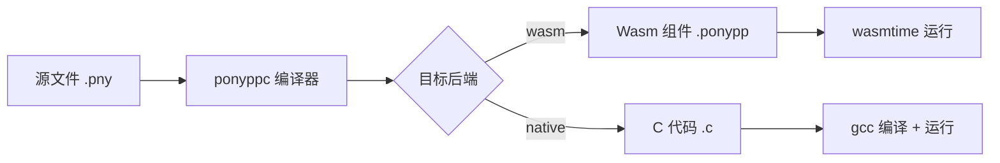

# 第 1 章 入门：Hello World 与开发环境

> **本章目标**
> 搭建 Pony++ 开发环境，编写第一个程序，理解 `actor main` 与 `new create()` 的基本概念。
>
> **学习时长**：15 分钟
> **前置要求**：无
> **对应 examples**：[`examples/00-hello/`](../examples/00-hello/)

---

## 1.1 概念地图



Pony++ 是一门**静态类型**、**Actor 并发**、**能力安全**的语言。本章你只需要理解一件事：

> **每个 Pony++ 程序由一个 `actor main` 构成入口，`new create()` 是自动调用的构造方法。**

---

## 1.2 安装与编译

### 1.2.1 安装

```bash
# 克隆仓库
git clone https://github.com/liunix61/Ponyplusplus.git
cd Ponyplusplus

# 编译编译器
mkdir build && cd build
cmake .. -DCMAKE_BUILD_TYPE=Release
cmake --build . -j4

# 安装到 PATH (可选)
sudo cp ponyppc /usr/local/bin/
```

验证安装：

```bash
$ ponyppc --version
ponyppc version 0.1.0
编译器语言: C11 (gcc 13.3.0 / clang)
Wasm 运行时: Wasmtime 47+ / Wasmer
WASI: Preview 2 + Preview 3 (0.3 async)
Wasm GC: Cheney 半空间复制 (默认启用)
```

### 1.2.2 两个目标后端

Pony++ 代码可以编译到**两个目标**：

| 目标 | 命令 | 输出 | 用途 |
|------|------|------|------|
| `wasi-p2` (默认) | `ponyppc -o out.ponypp file.pny` | Wasm 组件 | WebAssembly 运行时 |
| `native` | `ponyppc --target native -o out file.pny` | C 源码 | 本地直接执行 |

---

## 1.3 Hello World：你的第一个程序

### 1.3.1 写代码

新建文件 `hello.pny`：

```pony
// hello.pny - 最简单的 Pony++ 程序

actor main {
  new create() => {
    print("Hello, World!")
  }
}
```

### 1.3.2 编译并运行 (Wasm)

```bash
$ ponyppc -o hello.ponypp hello.pny
[ponyppc] target=wasi-p2
[ponyppc] 编译 'hello.pny' (76 字节)
  [1/6] 词法分析...
  [2/6] 语法分析...
  [3/6] 类型检查...
  [4/6] 引用能力验证...
  [5/6] 代码生成...
  已生成 Wasm 组件: hello.ponypp
  [6/6] 清理...
[ponyppc] 编译成功 ✓

$ wasmtime run hello.ponypp
Hello, World!
```

### 1.3.3 编译并运行 (native)

```bash
$ ponyppc --target native -o hello hello.pny
# 生成 hello.c
$ gcc hello.c -o hello
$ ./hello
Hello, World!
```

### 1.3.4 代码解析

```pony
actor main {                // ① 入口 actor，编译器自动识别
  new create() => {        // ② 构造方法，对象创建时自动调用
    print("Hello, World!") // ③ 内置函数，输出字符串
  }
}
```

| 符号 | 含义 | 必选 |
|------|------|------|
| `actor main` | 程序入口，必须存在且唯一 | ✅ |
| `new create()` | 构造方法，返回当前对象 | ✅ |
| `print()` | 标准输出，接收 1 个参数 | ✅ |

---

## 1.4 第二个程序：变量与拼接

理解 Hello World 后，我们加上**变量**。

新建 `greeting.pny`：

```pony
actor main {
  var name: String = "World"     // 声明 String 类型变量
  var greeting: String = "Hello, "

  new create() => {
    print(greeting + name + "!")  // 字符串拼接
  }
}
```

```bash
$ ponyppc -o greeting.ponypp greeting.pny && wasmtime run greeting.ponypp
Hello, World!
```

### 1.4.1 变量声明语法

```
var <name>: <Type> = <value>
```

| 部分 | 说明 |
|------|------|
| `var` | 变量声明关键字 |
| `name` | 变量名（小驼峰，如 `userName`） |
| `Type` | 类型名（大写首字母，如 `String`, `U32`） |
| `value` | 初始值（字面量） |

### 1.4.2 基本类型速查

| 类型 | 大小 | 范围 | 示例 |
|------|------|------|------|
| `U32` | 32 位 | 0 ~ 4,294,967,295 | `42` |
| `I32` | 32 位 | -2,147,483,648 ~ 2,147,483,647 | `-10` |
| `F64` | 64 位 | 双精度浮点 | `3.14` |
| `Bool` | 1 位 | `true` / `false` | `true` |
| `String` | 可变 | UTF-8 字符串 | `"hello"` |

---

## 1.5 多行输出

把变量拆开写，输出多行：

```pony
actor main {
  var lang: String = "Pony++"
  var year: String = "2026"
  var tagline: String = "Actor language for cloud-native"

  new create() => {
    print(lang + " - " + tagline)
    print("Version: " + year)
    print("Welcome to " + lang + "!")
  }
}
```

输出：

```
Pony++ - Actor language for cloud-native
Version: 2026
Welcome to Pony++!
```

---

## 1.6 关键术语（中英对照）

| 中文 | English | 首次出现章节 |
|------|---------|-------------|
| 行为 | Actor | 第1章 |
| 构造方法 | Constructor | 第1章 |
| 变量 | Variable | 第1章 |
| 静态类型 | Static Typing | 第1章 |
| 字符串拼接 | String Concatenation | 第1章 |
| 目标后端 | Target Backend | 第1章 |
| 组件 | Component | 第1章 |

完整术语表见附录 C。

---

## 1.7 陷阱与误区

### 陷阱 1.1 `actor main` 是入口，不是普通类

**错误代码**：
```pony
// ❌ 错误：写成普通类
class main {
  new create() => {
    print("Hello")
  }
}
```

**症状**：编译器报错 `no actor main found`

**根因**：Pony++ 是 Actor 语言，入口必须是 `actor`，不是 `class`。

**正确做法**：
```pony
// ✅ 正确：使用 actor
actor main {
  new create() => {
    print("Hello")
  }
}
```

**预防**：始终用 `actor main` 作为程序入口。

### 陷阱 1.2 忘记 `new create()` 构造方法

**错误代码**：
```pony
// ❌ 错误：没有 new create()
actor main {
  print("Hello")  // 编译错误：actor 体内不能直接执行语句
}
```

**症状**：编译器报错 `syntax error`

**根因**：`actor` 体内的可执行代码必须放在 `be`、`fun` 或 `new create()` 方法中。

**正确做法**：
```pony
// ✅ 正确：放在 new create() 中
actor main {
  new create() => {
    print("Hello")
  }
}
```

### 陷阱 1.3 变量必须显式声明类型

**错误代码**：
```pony
// ❌ 错误：没有类型注解
var name = "Pony++"
```

**症状**：编译器报错 `missing type annotation`

**根因**：Pony++ 是**静态类型**语言，每个变量必须显式声明类型，不支持类型推断。

**正确做法**：
```pony
// ✅ 正确：显式声明类型
var name: String = "Pony++"
```

---

## 1.8 本章实战：命令行参数问候

**任务**：写一个程序，输出 `Hello, <name>!`。

```pony
// hello-name.pny - 命令行参数问候

actor main {
  var name: String = "World"

  new create() => {
    // 模拟命令行参数 (实际实现需要 IO 库)
    name = "Pony++ User"
    print("Hello, " + name + "!")
    print("Welcome to the " + name + " community.")
    print("Have a nice day.")
  }
}
```

运行：

```bash
$ ponyppc -o hello-name.ponypp hello-name.pny
$ wasmtime run hello-name.ponypp
Hello, Pony++ User!
Welcome to the Pony++ User community.
Have a nice day.
```

---

## 1.9 习题

### 习题 1.1 ★★★☆☆
**类型**：改写代码
**题目**：把 `00-hello-world.pny` 改成输出 `Hello, Pony++ 2026!`，要求使用两个变量。

### 习题 1.2 ★★★☆☆
**类型**：调试代码
**题目**：以下代码有 3 个错误，找出并修复：
```pony
// broken.pny
class main {
  var name = "Pony++"
  var year: String = 2026
  print("Hello, " + name + "! Year " + year)
}
```

### 习题 1.3 ★★★★☆
**类型**：设计题
**题目**：写一个程序 `company-card.pny`，输出公司名片：
```
公司名: Pony++ Inc.
成立于: 2026
口号: Actor for everyone
```
要求使用至少 3 个变量。

### 习题 1.4 ★★★★★
**类型**：思考题
**题目**：解释为什么 Pony++ 需要 `actor main` 而不是像 Python 那样用脚本直接运行？参考 Erlang 和 Akka 的启动模型。

答案见附录 I。

---

## 1.10 下一步

- **第 2 章 数据类型与变量**：完整类型系统、字面量、类型转换
- **第 3 章 控制流**：`if`、`match`、`while`、`for`
- **阅读**：[`examples/00-hello/`](../examples/00-hello/) 全部 4 个示例
- **练习**：完成本章 4 道习题

---

## 1.11 本章小结

| 要点 | 一句话 |
|------|--------|
| 程序入口 | `actor main`，必须存在且唯一 |
| 构造方法 | `new create() => { ... }`，自动调用 |
| 输出 | `print("...")`，支持字符串拼接 |
| 变量 | `var name: Type = value`，必须显式类型 |
| 两个目标 | `wasm` 默认 / `native` 用 `--target native` |

---

**下一章预告**：第 2 章《数据类型与变量》将完整介绍 Pony++ 的类型系统、字面量、常量、类型转换和常用类型运算符。
