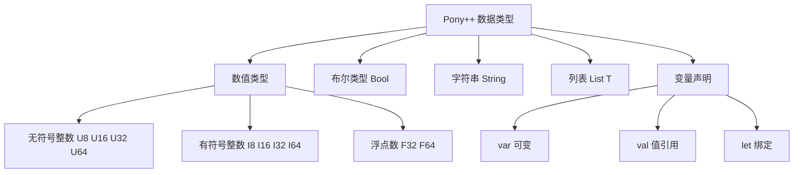

# 第 2 章 数据类型与变量

> **本章目标**
> 掌握 Pony++ 的全部内置数据类型，理解 `var` / `val` / `let` 三种声明方式，
> 学会类型注解与类型推断，能够正确使用数值、布尔、字符串和列表。
>
> **学习时长**：45 分钟
> **前置要求**：第 1 章
> **对应 examples**：[`examples/01-syntax/01-variables.pny`](../examples/01-syntax/01-variables.pny)

---

## 2.1 概念地图



Pony++ 是**静态类型**语言——每个变量的类型在编译时确定，不能在运行时改变。
这带来两个好处：编译器能在你运行程序之前就发现类型错误；编译器能为每种类型生成最优的机器码。

---

## 2.2 完整示例：变量与类型

先看一个完整的程序，用到本章所有核心概念：

```pony
// types-demo.pny - Pony++ 数据类型总览

actor main {
  new create() => {
    // 数值类型
    var count: U32 = 42           // 无符号 32 位整数
    var temp: I32 = -10           // 有符号 32 位整数
    var pi: F64 = 3.14159         // 64 位浮点数

    // 布尔类型
    var alive: Bool = true

    // 字符串
    var name: String = "Pony++"

    // 类型推断：省略注解，编译器自动推断
    var x = 100                   // 推断为 I32
    var msg = "hello"             // 推断为 String

    print(count)
    print(temp)
    print(pi)
    print(alive)
    print(name)
    print(x)
    print(msg)
  }
}
```

预期输出：

```
42
-10
3.14159
true
Pony++
100
hello
```

编译运行：

```bash
ponyppc -o types-demo.ponypp types-demo.pny
wasmtime run types-demo.ponypp
```

---

## 2.3 数值类型（Numeric Types）

### 2.3.1 整数类型

Pony++ 提供 8 种整数类型，分为无符号（U）和有符号（I）两组：

| 类型 | 位宽 | 范围 | C 对应 |
|------|------|------|--------|
| `U8` | 8 | 0 ~ 255 | `uint8_t` |
| `U16` | 16 | 0 ~ 65,535 | `uint16_t` |
| `U32` | 32 | 0 ~ 4,294,967,295 | `uint32_t` |
| `U64` | 64 | 0 ~ 18,446,744,073,709,551,615 | `uint64_t` |
| `I8` | 8 | -128 ~ 127 | `int8_t` |
| `I16` | 16 | -32,768 ~ 32,767 | `int16_t` |
| `I32` | 32 | -2,147,483,648 ~ 2,147,483,647 | `int32_t` |
| `I64` | 64 | -9.2×10¹⁸ ~ 9.2×10¹⁸ | `int64_t` |

**选型原则**：

- 默认用 `U32`（无符号，日常计数）或 `I32`（有符号，可能为负的值）
- 需要更大范围时用 `U64` / `I64`
- 嵌入式场景下 `U8` / `U16` 节省内存
- 网络协议、文件格式等需要精确位宽时用固定宽度类型

```pony
// integers.pny - 整数类型示例

actor main {
  new create() => {
    var byte: U8 = 255            // 最大 U8
    var short: U16 = 65535        // 最大 U16
    var word: U32 = 4294967295    // 最大 U32
    var dword: U64 = 18446744073709551615  // 最大 U64

    var sbyte: I8 = -128          // 最小 I8
    var sword: I32 = -2147483648  // 最小 I32

    print(byte)
    print(short)
    print(word)
    print(dword)
    print(sbyte)
    print(sword)
  }
}
```

### 2.3.2 浮点类型

| 类型 | 位宽 | 精度 | C 对应 |
|------|------|------|--------|
| `F32` | 32 | ~7 位有效数字 | `float` |
| `F64` | 64 | ~15 位有效数字 | `double` |

**选型原则**：默认用 `F64`。只有在嵌入式内存受限或需要与 C 的 `float` 接口对接时才用 `F32`。

```pony
// floats.pny - 浮点类型示例

actor main {
  new create() => {
    var pi32: F32 = 3.14159       // 32 位浮点
    var pi64: F64 = 3.14159265358979  // 64 位浮点
    var e: F64 = 2.718281828459045

    print(pi32)
    print(pi64)
    print(e)
  }
}
```

### 2.3.3 类型推断（Type Inference）

当你在声明时同时赋值，可以省略类型注解，编译器会自动推断：

```pony
// inference.pny - 类型推断

actor main {
  new create() => {
    var a = 42        // 推断为 I32（整数字面量默认类型）
    var b = 3.14      // 推断为 F64（浮点字面量默认类型）
    var c = true      // 推断为 Bool
    var d = "hello"   // 推断为 String

    // 推断等价于：
    // var a: I32 = 42
    // var b: F64 = 3.14
    // var c: Bool = true
    // var d: String = "hello"

    print(a)
    print(b)
    print(c)
    print(d)
  }
}
```

> **注意**：如果变量声明时没有赋值，必须写类型注解：
> ```pony
> var x: U32 = 0       // ✓ 有赋值，可省略注解
> var y: U32           // ✓ 无赋值，必须写注解
> var z                // ✗ 编译错误：无法推断类型
> ```

### 2.3.4 数值运算

```pony
// arithmetic.pny - 数值运算

actor main {
  new create() => {
    var a: U32 = 10
    var b: U32 = 3

    var sum: U32 = a + b
    var diff: U32 = a - b
    var prod: U32 = a * b
    var quot: U32 = a / b
    var rem: U32 = a % b

    print(sum)        // 13  加法
    print(diff)       // 7   减法
    print(prod)       // 30  乘法
    print(quot)       // 3   整数除法（截断）
    print(rem)        // 1   取模

    // 浮点运算
    var x: F64 = 10.0
    var y: F64 = 3.0
    var fdiv: F64 = x / y
    print(fdiv)       // 3.3333333333333335  浮点除法
  }
}
```

> **陷阱**：两个整数相除是**整数除法**，结果会截断小数部分。
> `10 / 3` 的结果是 `3`，不是 `3.333...`。需要浮点结果时，用浮点类型：
> ```pony
> var a: F64 = 10.0
> var b: F64 = 3.0
> print(a / b)  // 3.3333333333333335
> ```

---

## 2.4 布尔类型（Bool）

`Bool` 类型只有两个值：`true` 和 `false`。

```pony
// bools.pny - 布尔类型

actor main {
  new create() => {
    var ok: Bool = true
    var fail: Bool = false

    // 布尔运算
    var a: Bool = true
    var b: Bool = false

    var and_result: Bool = a and b
    var or_result: Bool = a or b
    var not_result: Bool = not a

    print(and_result)  // false  逻辑与
    print(or_result)   // true   逻辑或
    print(not_result)  // false  逻辑非

    // 比较运算产生 Bool
    var x: U32 = 10
    var y: U32 = 20
    var lt: Bool = x < y
    var eq: Bool = x == y
    var ne: Bool = x != y

    print(lt)          // true
    print(eq)          // false
    print(ne)          // true
  }
}
```

**运算符优先级**（从高到低）：

| 优先级 | 运算符 | 说明 |
|--------|--------|------|
| 1 | `not` | 逻辑非 |
| 2 | `*` `/` `%` | 乘、除、取模 |
| 3 | `+` `-` | 加、减 |
| 4 | `<` `>` `<=` `>=` | 比较 |
| 5 | `==` `!=` | 等于、不等于 |
| 6 | `and` | 逻辑与 |
| 7 | `or` | 逻辑或 |

---

## 2.5 字符串类型（String）

`String` 是不可变的 UTF-8 字符串。

```pony
// strings.pny - 字符串操作

actor main {
  new create() => {
    var greeting: String = "Hello"
    var name: String = "Pony++"

    // 字符串拼接
    var msg: String = greeting + ", " + name + "!"
    print(msg)        // Hello, Pony++!

    // 字符串长度
    var len: U32 = msg.len()
    print(len)        // 13

    // 字符串比较
    var a: String = "abc"
    var b: String = "abc"
    print(a == b)     // true
  }
}
```

**String 常用方法**：

| 方法 | 返回类型 | 说明 |
|------|----------|------|
| `len()` | `U32` | 字符串长度 |
| `+` | `String` | 字符串拼接 |
| `==` | `Bool` | 字符串比较 |

> **陷阱**：Pony++ 的字符串方法是 `len()`，不是 `length()`。
> 这是与 Java/JavaScript 的区别。

---

## 2.6 列表类型（List[T]）

`List[T]` 是泛型有序集合，`T` 是元素类型。

```pony
// lists.pny - 列表操作

actor main {
  new create() => {
    // 字面量创建
    var numbers: List[U32] = [1, 2, 3, 4, 5]
    var names: List[String] = ["Alice", "Bob", "Carol"]

    // 遍历
    for n in numbers {
      print(n)
    }

    for name in names {
      print(name)
    }

    // 长度
    print(numbers.len())  // 5
  }
}
```

预期输出：

```
1
2
3
4
5
Alice
Bob
Carol
5
```

---

## 2.7 变量声明：var / val / let

Pony++ 提供三种声明方式：

| 关键字 | 可变性 | 说明 |
|--------|--------|------|
| `var` | 可变 | 可以重新赋值 |
| `val` | 不可变 | 值引用，创建后不能修改 |
| `let` | 绑定 | 变量绑定不能改变，但对象内部可变 |

### 2.7.1 var：可变变量

```pony
// var-demo.pny - var 声明

actor main {
  new create() => {
    var count: U32 = 0
    count = count + 1     // ✓ 可以重新赋值
    count += 1            // ✓ 复合赋值
    print(count)          // 2
  }
}
```

### 2.7.2 val：不可变值

```pony
// val-demo.pny - val 声明

actor main {
  new create() => {
    val pi: F64 = 3.14159
    // pi = 3.15         // ✗ 编译错误：val 不可修改
    print(pi)
  }
}
```

> **实际使用**：`val` 主要用于常量和函数参数的只读约束。
> 日常编程中大部分变量用 `var`，需要不可变保证时用 `val`。

---

## 2.8 类型转换（Type Casting）

Pony++ 的类型转换是显式的——不能隐式将一个类型转为另一个。

```pony
// casting.pny - 类型转换

actor main {
  new create() => {
    var a: U32 = 42
    var b: F64 = 3.14

    // 整数 → 浮点
    var a_f: F64 = a.f64()

    // 浮点 → 整数（截断小数）
    var b_i: I32 = b.i32()

    // 整数 → 字符串
    var a_s: String = a.string()

    print(a_f)    // 42.0
    print(b_i)    // 3
    print(a_s)    // 42
  }
}
```

**类型转换方法**：

| 方法 | 说明 |
|------|------|
| `.u8()` `.u16()` `.u32()` `.u64()` | 转为无符号整数 |
| `.i8()` `.i16()` `.i32()` `.i64()` | 转为有符号整数 |
| `.f32()` `.f64()` | 转为浮点数 |
| `.string()` | 转为字符串 |

> **陷阱**：类型转换可能丢失信息。
> `256.u8()` 的结果是 `0`（溢出截断），`3.99.i32()` 的结果是 `3`（截断小数）。

---

## 2.9 本章陷阱与误区

### 陷阱 1：整数除法截断

```pony
var a: U32 = 10
var b: U32 = 3
print(a / b)      // 3，不是 3.333
```

**解法**：需要浮点结果时用 `F64`：
```pony
var a: F64 = 10.0
var b: F64 = 3.0
print(a / b)      // 3.3333333333333335
```

### 陷阱 2：无符号整数不能为负

```pony
var x: U32 = -1   // ✗ 编译错误
```

**解法**：用有符号类型 `I32`。

### 陷阱 3：类型不匹配

```pony
var x: U32 = 42
var y: I32 = x    // ✗ 编译错误：U32 不能赋给 I32
```

**解法**：显式转换：
```pony
var x: U32 = 42
var y: I32 = x.i32()  // ✓
```

### 陷阱 4：String 方法名

```pony
var s: String = "hello"
print(s.len())       // ✓
print(s.length())    // ✗ 编译错误：没有 length() 方法
```

### 陷阱 5：val 声明后修改

```pony
val x: U32 = 10
x = 20   // ✗ 编译错误
```

---

## 2.10 本章实战：温度转换器

综合运用本章知识，写一个华氏度 ↔ 摄氏度转换器：

```pony
// temperature.pny - 温度转换器

actor main {
  new create() => {
    // 华氏 → 摄氏: C = (F - 32) × 5 / 9
    var fahrenheit: F64 = 98.6
    var celsius: F64 = (fahrenheit - 32.0) * 5.0 / 9.0
    print(fahrenheit)
    print(celsius)

    // 摄氏 → 华氏: F = C × 9 / 5 + 32
    var c2: F64 = 37.0
    var f2: F64 = c2 * 9.0 / 5.0 + 32.0
    print(c2)
    print(f2)

    // 整数版本（截断小数）
    var f_int: I32 = 212
    var c_int: I32 = (f_int - 32) * 5 / 9
    print(f_int)
    print(c_int)
  }
}
```

预期输出：

```
98.6
36.99999999999999
37
98.6
212
100
```

编译运行：

```bash
ponyppc -o temperature.ponypp temperature.pny
wasmtime run temperature.ponypp
```

---

## 2.11 习题

**习题 2.1** 声明一个 `U32` 变量存储你的年龄，一个 `String` 变量存储你的名字，打印两者。

**习题 2.2** 计算半径为 5 的圆的面积（πr²），结果用 `F64` 存储。

**习题 2.3** 以下代码有什么问题？如何修复？

```pony
var x: U8 = 300
var y: String = "count: " + x
```

**习题 2.4** 写一个程序，将秒数转换为"X 小时 Y 分 Z 秒"的格式。
输入 `3661`，输出 `1 小时 1 分 1 秒`。

**习题 2.5** 解释 `var`、`val`、`let` 的区别。什么时候用哪个？

---

## 2.12 下一步

你已经掌握了 Pony++ 的全部数据类型。下一章我们学习**控制流**——
如何用 `if`/`else` 做条件判断，用 `while` 做循环，用 `match` 做模式匹配。

→ **第 3 章：控制流**
