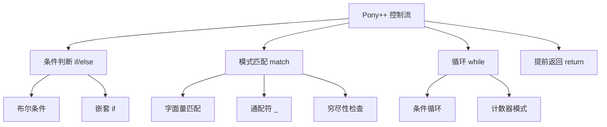

# 第 3 章 控制流

> **本章目标**
> 掌握 Pony++ 的条件判断（`if`/`else`）、模式匹配（`match`）和循环（`while`），
> 理解 Pony++ 的控制流与 C/Rust 的异同。
>
> **学习时长**：40 分钟
> **前置要求**：第 2 章
> **对应 examples**：[`examples/01-syntax/02-control-flow.pny`](../examples/01-syntax/02-control-flow.pny)

---

## 3.1 概念地图



Pony++ 的控制流只有三种：`if`/`else` 做条件分支，`match` 做模式匹配，`while` 做循环。
没有 `for` 循环（用 `while` 或 `for-in` 遍历），没有 `switch`（用 `match` 替代）。

---

## 3.2 完整示例：成绩评级器

```pony
// grade.pny - 成绩评级器

actor main {
  new create() => {
    var score: U32 = 85

    if score >= 90 {
      print("A")
    } else if score >= 80 {
      print("B")
    } else if score >= 70 {
      print("C")
    } else if score >= 60 {
      print("D")
    } else {
      print("F")
    }
  }
}
```

预期输出：

```
B
```

编译运行：

```bash
ponyppc -o grade.ponypp grade.pny
wasmtime run grade.ponypp
```

---

## 3.3 条件判断：if / else

### 3.3.1 基本语法

```pony
if 条件 {
  // 条件为 true 时执行
} else {
  // 条件为 false 时执行
}
```

条件必须是 `Bool` 类型。Pony++ 不允许用整数代替布尔（没有 C 的 `if (x)` 简写）。

```pony
// if-basic.pny - if 基本用法

actor main {
  new create() => {
    var x: U32 = 42

    if x > 0 {
      print("positive")
    } else {
      print("non-positive")
    }
  }
}
```

### 3.3.2 else if 链

```pony
// if-chain.pny - else if 链

fun classify(n: I32): String => {
  if n > 0 {
    return "positive"
  } else if n < 0 {
    return "negative"
  } else {
    return "zero"
  }
}

actor main {
  new create() => {
    print(classify(42))
    print(classify(-7))
    print(classify(0))
  }
}
```

预期输出：

```
positive
negative
zero
```

### 3.3.3 嵌套 if

```pony
// if-nested.pny - 嵌套条件

actor main {
  new create() => {
    var x: U32 = 15

    if x > 10 {
      if x > 20 {
        print("big")
      } else {
        print("medium")
      }
    } else {
      print("small")
    }
  }
}
```

> **建议**：嵌套超过 2 层时，考虑用 `match` 或提取函数来替代，保持代码清晰。

---

## 3.4 模式匹配：match

`match` 是 Pony++ 最强大的控制流结构。它对一个表达式进行模式匹配，类似于 Rust 的 `match`。

### 3.4.1 基本语法

```pony
match 表达式 {
  模式1 => 语句
  模式2 => 语句
  _     => 语句   // 通配符，匹配所有其他情况
}
```

### 3.4.2 整数匹配

```pony
// match-int.pny - 整数匹配

actor main {
  new create() => {
    var x: I32 = 1

    match x {
      1 => print("one")
      2 => print("two")
      3 => print("three")
      _ => print("other")
    }
  }
}
```

预期输出：

```
one
```

### 3.4.3 字符串匹配

```pony
// match-string.pny - 字符串匹配

actor main {
  new create() => {
    var color: String = "red"

    match color {
      "red"   => print("stop")
      "green" => print("go")
      "blue"  => print("sky")
      _       => print("unknown color")
    }
  }
}
```

### 3.4.4 match vs if/else

什么时候用 `match`，什么时候用 `if`？

| 场景 | 推荐 | 原因 |
|------|------|------|
| 对单个值的多个分支 | `match` | 更清晰，编译器可检查穷尽性 |
| 范围比较（`> 90`） | `if/else` | `match` 不支持范围模式 |
| 多个独立条件 | `if/else` | `match` 只匹配一个表达式 |
| 处理枚举/选项类型 | `match` | 这是 `match` 的设计初衷 |

```pony
// match-vs-if.pny - 选择合适的控制流

actor main {
  new create() => {
    var score: U32 = 85

    // 用 if/else：范围比较
    if score >= 90 {
      print("A")
    } else if score >= 80 {
      print("B")
    } else {
      print("F")
    }

    // 用 match：精确值匹配
    var day: U32 = 3
    match day {
      1 => print("Monday")
      2 => print("Tuesday")
      3 => print("Wednesday")
      _ => print("Other day")
    }
  }
}
```

---

## 3.5 循环：while

### 3.5.1 基本语法

```pony
while 条件 {
  // 条件为 true 时反复执行
}
```

```pony
// while-basic.pny - while 基本用法

actor main {
  new create() => {
    var i: U32 = 0
    while i < 5 {
      print(i)
      i += 1
    }
  }
}
```

预期输出：

```
0
1
2
3
4
```

### 3.5.2 累加模式

```pony
// while-sum.pny - while 累加

actor main {
  new create() => {
    var sum: U32 = 0
    var i: U32 = 1
    while i <= 100 {
      sum += i
      i += 1
    }
    print(sum)  // 5050
  }
}
```

### 3.5.3 嵌套循环

```pony
// while-nested.pny - 九九乘法表

actor main {
  new create() => {
    var i: U32 = 1
    while i <= 3 {
      var j: U32 = 1
      while j <= 3 {
        print(i)
        j += 1
      }
      i += 1
    }
  }
}
```

### 3.5.4 for-in 遍历

遍历列表时用 `for-in` 比 `while` 更简洁：

```pony
// for-in.pny - for-in 遍历

actor main {
  new create() => {
    var names: List[String] = ["Alice", "Bob", "Carol"]

    for name in names {
      print(name)
    }
  }
}
```

---

## 3.6 提前返回：return

`return` 用于提前退出函数并返回值：

```pony
// early-return.pny - 提前返回

fun classify(n: U32): String => {
  if n == 0 {
    return "zero"
  }
  if n < 10 {
    return "small"
  }
  return "big"
}

actor main {
  new create() => {
    print(classify(0))    // zero
    print(classify(5))    // small
    print(classify(100))  // big
  }
}
```

> **风格建议**：优先用"提前返回"减少嵌套。比较：
>
> ```pony
> // 不推荐：深层嵌套
> fun check(x: U32): Bool => {
>   if x > 0 {
>     if x < 100 {
>       return true
>     } else {
>       return false
>     }
>   } else {
>     return false
>   }
> }
>
> // 推荐：提前返回
> fun check(x: U32): Bool => {
>   if x == 0 {
>     return false
>   }
>   return x < 100
> }
> ```

---

## 3.7 运算符与优先级

### 3.7.1 比较运算符

| 运算符 | 含义 | 示例 |
|--------|------|------|
| `==` | 等于 | `x == 10` |
| `!=` | 不等于 | `x != 10` |
| `<` | 小于 | `x < 10` |
| `>` | 大于 | `x > 10` |
| `<=` | 小于等于 | `x <= 10` |
| `>=` | 大于等于 | `x >= 10` |

### 3.7.2 逻辑运算符

| 运算符 | 含义 | 短路 |
|--------|------|------|
| `and` | 逻辑与 | 是（左侧为 false 时不计算右侧） |
| `or` | 逻辑或 | 是（左侧为 true 时不计算右侧） |
| `not` | 逻辑非 | — |

```pony
// logic.pny - 逻辑运算

actor main {
  new create() => {
    var a: Bool = true
    var b: Bool = false

    var r1: Bool = a and b   // false
    var r2: Bool = a or b    // true
    var r3: Bool = not a     // false

    print(r1)
    print(r2)
    print(r3)

    // 短路求值示例
    var x: U32 = 0
    var safe: Bool = x != 0 and (10 / x) > 1
    print(safe)  // false，不会触发除零
  }
}
```

### 3.7.3 运算符优先级表

| 优先级 | 运算符 | 结合性 |
|--------|--------|--------|
| 1（最高） | `not` | 右结合 |
| 2 | `*` `/` `%` | 左结合 |
| 3 | `+` `-` | 左结合 |
| 4 | `<` `>` `<=` `>=` | 左结合 |
| 5 | `==` `!=` | 左结合 |
| 6 | `and` | 左结合 |
| 7（最低） | `or` | 左结合 |

不确定优先级时用括号——这永远不会错。

---

## 3.8 本章陷阱与误区

### 陷阱 1：条件必须是 Bool

```pony
var x: U32 = 42
if x {          // ✗ 编译错误：U32 不是 Bool
  print("yes")
}
```

**解法**：显式比较：
```pony
if x != 0 {     // ✓
  print("yes")
}
```

### 陷阱 2：while 忘记更新计数器

```pony
var i: U32 = 0
while i < 5 {
  print(i)
  // 忘记 i += 1 → 死循环
}
```

### 陷阱 3：match 的通配符位置

通配符 `_` 应放在最后。放在中间会让后面的分支永远不可达：

```pony
match x {
  _ => print("any")     // 这里匹配所有
  1 => print("one")     // 永远不可达
}
```

### 陷阱 4：整数除法在条件中

```pony
var x: U32 = 5
if x / 2 == 2.5 {  // ✗ 编译错误：U32 除法结果是整数 2
  print("yes")
}
```

**解法**：用浮点数比较，或调整预期值。

### 陷阱 5：else 后面不能有条件

```pony
if a {
  // ...
} else if b {
  // ...
} else if {   // ✗ 语法错误：else 后面不能是空的 if
  // ...
}
```

---

## 3.9 本章实战：FizzBuzz

经典 FizzBuzz：打印 1-15，3 的倍数打印 "Fizz"，5 的倍数打印 "Buzz"，既是 3 又是 5 的倍数打印 "FizzBuzz"。

```pony
// fizzbuzz.pny - FizzBuzz

actor main {
  new create() => {
    var i: U32 = 1
    while i <= 15 {
      if i % 15 == 0 {
        print("FizzBuzz")
      } else if i % 3 == 0 {
        print("Fizz")
      } else if i % 5 == 0 {
        print("Buzz")
      } else {
        print(i)
      }
      i += 1
    }
  }
}
```

预期输出：

```
1
2
Fizz
4
Buzz
Fizz
7
8
Fizz
Buzz
11
Fizz
13
14
FizzBuzz
```

---

## 3.10 本章实战：猜数字（简化版）

用 `match` 实现一个简单的猜数字逻辑：

```pony
// guess.pny - 猜数字

actor main {
  new create() => {
    var secret: U32 = 42
    var guess: U32 = 30

    if guess == secret {
      print("Correct!")
    } else if guess < secret {
      print("Too low")
    } else {
      print("Too high")
    }

    // 用 match 处理游戏状态
    var state: String = "playing"
    match state {
      "playing" => print("Game is running")
      "paused"  => print("Game is paused")
      "over"    => print("Game over")
      _         => print("Unknown state")
    }
  }
}
```

---

## 3.11 习题

**习题 3.1** 写一个程序，判断一个数是奇数还是偶数。

**习题 3.2** 用 `while` 计算 10 的阶乘（10!）。

**习题 3.3** 用 `match` 写一个简单的计算器：
输入两个数和一个运算符（`"+"`, `"-"`, `"*"`, `"/"`），输出结果。

**习题 3.4** 以下代码有什么问题？

```pony
var x: U32 = 5
match x {
  0 => print("zero")
  5 => print("five")
}
```

**习题 3.5** 写一个程序打印 1-20 中所有素数。

---

## 3.12 下一步

你已经掌握了 Pony++ 的全部控制流。下一章我们学习**函数**——
如何用 `fun` 定义纯函数，用 `be` 定义行为方法，理解两者的本质区别。

→ **第 4 章：函数——fun 与 be**
