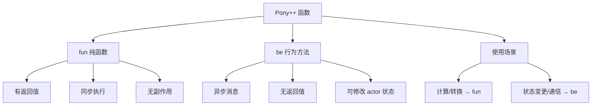

# 第 4 章 函数：fun 与 be

> **本章目标**
> 掌握 Pony++ 的两种函数定义方式——`fun`（纯函数）和 `be`（行为方法），
> 理解它们的本质区别，学会递归、辅助函数和方法链。
>
> **学习时长**：40 分钟
> **前置要求**：第 2-3 章
> **对应 examples**：[`examples/01-syntax/03-functions.pny`](../examples/01-syntax/03-functions.pny)

---

## 4.1 概念地图



Pony++ 有两种函数：

- **`fun`**：纯函数（pure function），同步执行，有返回值，不修改 actor 状态。
- **`be`**：行为方法（behavior），异步执行，无返回值，可以修改 actor 状态。

这是 Pony++ 最重要的设计之一。`fun` 保证无副作用，`be` 处理副作用。

---

## 4.2 完整示例：阶乘计算

```pony
// factorial.pny - 阶乘函数

fun factorial(n: U32): U64 => {
  if n <= 1 {
    return 1
  }
  return n * factorial(n - 1)
}

actor main {
  new create() => {
    print(factorial(0))   // 1
    print(factorial(1))   // 1
    print(factorial(5))   // 120
    print(factorial(10))  // 3628800
  }
}
```

预期输出：

```
1
1
120
3628800
```

编译运行：

```bash
ponyppc -o factorial.ponypp factorial.pny
wasmtime run factorial.ponypp
```

---

## 4.3 fun：纯函数

### 4.3.1 基本语法

```pony
fun 函数名(参数: 类型, ...): 返回类型 => {
  // 函数体
  return 值
}
```

```pony
// fun-basic.pny - fun 基本用法

fun add(a: U32, b: U32): U32 => {
  return a + b
}

actor main {
  new create() => {
    print(add(1, 2))      // 3
    print(add(10, 20))    // 30
  }
}
```

### 4.3.2 无返回值的 fun

没有返回类型注解的 `fun` 返回 `None`（相当于 C 的 `void`）：

```pony
// fun-void.pny - 无返回值的 fun

fun greet(name: String) => {
  print("Hello, " + name + "!")
}

actor main {
  new create() => {
    greet("Alice")   // Hello, Alice!
    greet("Bob")     // Hello, Bob!
  }
}
```

### 4.3.3 顶层函数与方法函数

`fun` 可以定义在两个位置：

```pony
// 顶层函数（全局）
fun add(a: U32, b: U32): U32 => {
  return a + b
}

class Calculator {
  var base: U32

  new create(base: U32) => {
    this.base = base
  }

  // 方法函数（属于类）
  fun add_to_base(x: U32): U32 => {
    return this.base + x
  }
}

actor main {
  new create() => {
    print(add(1, 2))              // 调用顶层函数

    var calc: Calculator = Calculator(100)
    print(calc.add_to_base(42))   // 调用方法函数
  }
}
```

### 4.3.4 递归

`fun` 支持递归——函数调用自身：

```pony
// recursion.pny - 递归函数

fun fibonacci(n: U32): U32 => {
  if n <= 1 {
    return n
  }
  return fibonacci(n - 1) + fibonacci(n - 2)
}

fun gcd(a: U32, b: U32): U32 => {
  if b == 0 {
    return a
  }
  return gcd(b, a % b)
}

actor main {
  new create() => {
    print(fibonacci(10))   // 55
    print(gcd(48, 18))     // 6
  }
}
```

> **注意**：递归深度过大会导致栈溢出。嵌入式 MCU 上尤其要注意——
> 递归深度超过几百层就应该改用循环。

### 4.3.5 辅助函数组合

将复杂逻辑拆分为小的辅助函数：

```pony
// helpers.pny - 辅助函数组合

fun max(a: U32, b: U32): U32 => {
  if a > b {
    return a
  }
  return b
}

fun min(a: U32, b: U32): U32 => {
  if a < b {
    return a
  }
  return b
}

fun abs_diff(a: U32, b: U32): U32 => {
  return max(a, b) - min(a, b)
}

fun clamp(value: U32, low: U32, high: U32): U32 => {
  return max(low, min(high, value))
}

actor main {
  new create() => {
    print(max(10, 20))         // 20
    print(min(10, 20))         // 10
    print(abs_diff(10, 20))    // 10
    print(clamp(15, 0, 100))   // 15
    print(clamp(150, 0, 100))  // 100
  }
}
```

---

## 4.4 be：行为方法

### 4.4.1 基本语法

```pony
be 方法名(参数: 类型, ...) => {
  // 方法体（异步执行）
  // 不能有 return 值
}
```

`be` 是 Actor 模型的核心。当你调用 `be` 方法时，不会立即执行——
而是向目标 actor 发送一条**异步消息**，在目标 actor 的邮箱中排队等待处理。

```pony
// be-basic.pny - be 基本用法

actor Worker {
  var count: U32

  new create() => {
    count = 0
  }

  be increment() => {
    count += 1
    print(count)
  }

  be decrement() => {
    count -= 1
    print(count)
  }
}

actor main {
  new create() => {
    var w: Worker = Worker()
    w.increment()   // 发送消息，异步执行
    w.increment()   // 发送消息，异步执行
    w.decrement()   // 发送消息，异步执行
  }
}
```

预期输出：

```
1
2
1
```

### 4.4.2 be 的本质：异步消息

理解 `be` 的执行模型：

```
main actor          Worker actor
    |                    |
    |-- increment() -->  |  消息1入队
    |-- increment() -->  |  消息2入队
    |-- decrement() -->  |  消息3入队
    |                    |
    |              [依次处理]
    |              消息1: count=1, print(1)
    |              消息2: count=2, print(2)
    |              消息3: count=1, print(1)
```

关键特性：

1. **消息排队**：`be` 调用立即返回，不等待执行完成
2. **顺序执行**：同一个 actor 的消息按发送顺序依次处理
3. **无竞争**：不需要锁——每个 actor 一次只处理一条消息
4. **无返回值**：`be` 不能有返回值（调用者不等待结果）

### 4.4.3 be 修改 actor 状态

`be` 是唯一能修改 actor 内部状态的方式：

```pony
// be-state.pny - be 修改状态

actor BankAccount {
  var balance: U64

  new create(initial: U64) => {
    balance = initial
  }

  be deposit(amount: U64) => {
    balance += amount
    print("Deposited")
  }

  be withdraw(amount: U64) => {
    if balance >= amount {
      balance -= amount
      print("Withdrawn")
    } else {
      print("Insufficient funds")
    }
  }

  be show_balance() => {
    print(balance)
  }
}

actor main {
  new create() => {
    var account: BankAccount = BankAccount(1000)
    account.deposit(500)
    account.withdraw(200)
    account.show_balance()  // 1300
  }
}
```

---

## 4.5 fun vs be：如何选择

| 特性 | `fun` | `be` |
|------|-------|------|
| 执行方式 | 同步（立即执行） | 异步（消息队列） |
| 返回值 | 有 | 无 |
| 修改状态 | 不能 | 能 |
| 线程安全 | 天然安全（无副作用） | 天然安全（actor 隔离） |
| 典型用途 | 计算、转换、查询 | 状态变更、通信、副作用 |

**选择原则**：

- **计算一个值** → `fun`
- **改变状态** → `be`
- **发送消息给其他 actor** → `be`
- **读取并返回数据** → `fun`
- **执行 IO** → `be`

```pony
// fun-vs-be.pny - 正确选择

class Temperature {
  var celsius: F64

  new create(celsius: F64) => {
    this.celsius = celsius
  }

  // fun：纯计算，不修改状态
  fun to_fahrenheit(): F64 => {
    return this.celsius * 9.0 / 5.0 + 32.0
  }

  // fun：纯查询
  fun get_celsius(): F64 => {
    return this.celsius
  }
}

actor Thermostat {
  var target: F64

  new create(initial: F64) => {
    target = initial
  }

  // be：修改状态
  be set_target(temp: F64) => {
    target = temp
    print("Target updated")
  }

  // be：对外报告状态
  be report() => {
    print(target)
  }
}

actor main {
  new create() => {
    // fun 的使用
    var t: Temperature = Temperature(37.0)
    print(t.to_fahrenheit())   // 98.6

    // be 的使用
    var thermostat: Thermostat = Thermostat(22.0)
    thermostat.set_target(25.0)
    thermostat.report()        // 25
  }
}
```

---

## 4.6 本章陷阱与误区

### 陷阱 1：be 不能有返回值

```pony
be compute(x: U32): U32 => {  // ✗ 编译错误：be 不能有返回类型
  return x * 2
}
```

**解法**：用 `fun` 代替，或通过另一个 `be` 发送结果。

### 陷阱 2：fun 不能修改 actor 状态

```pony
actor Counter {
  var count: U32
  new create() => { count = 0 }

  fun increment(): U32 => {
    count += 1    // ✗ 编译错误：fun 不能修改状态
    return count
  }
}
```

**解法**：状态修改用 `be`。

### 陷阱 3：be 调用后不能立即读取结果

```pony
actor Worker {
  var result: U32
  new create() => { result = 0 }

  be compute(x: U32) => {
    result = x * 2
  }

  be show() => {
    print(result)
  }
}

actor main {
  new create() => {
    var w: Worker = Worker()
    w.compute(21)
    w.show()    // 可能在 compute 执行之前运行！
  }
}
```

**原因**：`be` 是异步的。消息按顺序处理，所以 `show` 一定在 `compute` 之后执行。
但如果你在 `main` 中同步读取 `w.result`，那才是真正的竞争。

### 陷阱 4：递归没有终止条件

```pony
fun bad_recursion(n: U32): U32 => {
  return bad_recursion(n)  // ✗ 无限递归 → 栈溢出
}
```

---

## 4.7 本章实战：温度转换库

综合运用 `fun` 和 `be`，构建一个温度转换工具：

```pony
// temperature-lib.pny - 温度转换库

// 纯函数：华氏 → 摄氏
fun f_to_c(f: F64): F64 => {
  return (f - 32.0) * 5.0 / 9.0
}

// 纯函数：摄氏 → 华氏
fun c_to_f(c: F64): F64 => {
  return c * 9.0 / 5.0 + 32.0
}

// 纯函数：摄氏 → 开尔文
fun c_to_k(c: F64): F64 => {
  return c + 273.15
}

// 纯函数：开尔文 → 摄氏
fun k_to_c(k: F64): F64 => {
  return k - 273.15
}

// 温度描述
fun describe(c: F64): String => {
  if c < 0.0 {
    return "freezing"
  }
  if c < 15.0 {
    return "cold"
  }
  if c < 30.0 {
    return "comfortable"
  }
  return "hot"
}

actor TemperatureService {
  new create() => {}

  be convert_fahrenheit(f: F64) => {
    var c: F64 = f_to_c(f)
    print(f)
    print(c)
  }

  be convert_celsius(c: F64) => {
    var f: F64 = c_to_f(c)
    var k: F64 = c_to_k(c)
    print(c)
    print(f)
    print(k)
  }
}

actor main {
  new create() => {
    // 使用纯函数
    print(f_to_c(212.0))    // 100.0
    print(c_to_f(0.0))      // 32.0
    print(c_to_k(0.0))      // 273.15
    print(describe(-5.0))   // freezing
    print(describe(22.0))   // comfortable

    // 使用 actor 服务
    var svc: TemperatureService = TemperatureService()
    svc.convert_fahrenheit(98.6)
    svc.convert_celsius(37.0)
  }
}
```

---

## 4.8 习题

**习题 4.1** 写一个 `fun` 计算一个列表中所有元素的和。

**习题 4.2** 写一个 `fun is_prime(n: U32): Bool` 判断素数。

**习题 4.3** 写一个 actor `Logger`，有 `be log(msg: String)` 方法，
每条消息前自动加上序号（`[1]`, `[2]`, ...）。

**习题 4.4** 解释为什么 `be` 不能有返回值。如果需要获取 actor 的状态，应该怎么做？

**习题 4.5** 写一个递归函数 `power(base: U32, exp: U32): U64` 计算幂。

---

## 4.9 下一步

你已经掌握了 `fun` 和 `be`。下一章我们深入**对象与结构体**——
如何用 `class` 定义自定义类型，理解继承和组合。

→ **第 5 章：对象与结构体**
