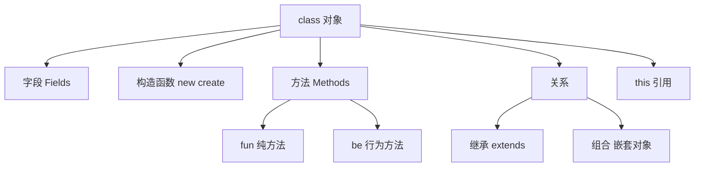

# 第 5 章 对象与结构体

> **本章目标**
> 掌握 `class` 的定义与使用，理解字段、构造函数、方法、继承和组合，
> 能够设计自己的数据类型。
>
> **学习时长**：45 分钟
> **前置要求**：第 2-4 章
> **对应 examples**：[`examples/01-syntax/04-objects.pny`](../examples/01-syntax/04-objects.pny)

---

## 5.1 概念地图



Pony++ 用 `class` 定义自定义类型。class 是**值语义**的轻量级结构体——
创建在栈上（native 后端）或线性内存中（Wasm 后端），没有垃圾回收开销。

---

## 5.2 完整示例：Person 类

```pony
// person.pny - Person 类

class Person {
  var name: String
  var age: U32

  new create(name: String, age: U32) => {
    this.name = name
    this.age = age
  }

  fun introduce(): String => {
    return "I am " + this.name + ", " + this.age.string() + " years old"
  }

  be grow() => {
    this.age += 1
  }
}

actor main {
  new create() => {
    var p: Person = Person("Alice", 30)
    print(p.introduce())
  }
}
```

预期输出：

```
I am Alice, 30 years old
```

编译运行：

```bash
ponyppc -o person.ponypp person.pny
wasmtime run person.ponypp
```

---

## 5.3 class 基础

### 5.3.1 定义 class

```pony
class 类名 {
  var 字段名: 类型     // 可变字段
  val 字段名: 类型     // 不可变字段

  new create(参数: 类型) => {
    // 构造函数体
  }

  fun 方法名(): 返回类型 => {
    // 纯方法
  }

  be 方法名() => {
    // 行为方法
  }
}
```

### 5.3.2 字段（Fields）

字段是 class 的数据成员：

```pony
// fields.pny - 字段声明

class Config {
  var host: String      // 可变字段
  var port: U32         // 可变字段
  val max_conn: U32 = 100  // 不可变字段（有默认值）

  new create(host: String, port: U32) => {
    this.host = host
    this.port = port
    // max_conn 已有默认值，不需要在构造函数中赋值
  }
}

actor main {
  new create() => {
    var cfg: Config = Config("localhost", 8080)
    print(cfg.host)
    print(cfg.port)
    print(cfg.max_conn)
  }
}
```

### 5.3.3 构造函数（Constructor）

`new create()` 是默认构造函数：

```pony
// constructor.pny - 构造函数

class Vec2 {
  var x: F64
  var y: F64

  new create(x: F64, y: F64) => {
    this.x = x
    this.y = y
  }

  // 另一个构造函数：从极坐标创建
  new from_polar(r: F64, theta: F64) => {
    this.x = r * theta.cos()
    this.y = r * theta.sin()
  }
}

actor main {
  new create() => {
    var a: Vec2 = Vec2(3.0, 4.0)
    var b: Vec2 = Vec2.from_polar(1.0, 0.0)
    print(a.x)
    print(b.x)
  }
}
```

---

## 5.4 方法

### 5.4.1 fun 方法（纯方法）

```pony
// methods-fun.pny - 纯方法

class Rectangle {
  var width: F64
  var height: F64

  new create(w: F64, h: F64) => {
    this.width = w
    this.height = h
  }

  fun area(): F64 => {
    return this.width * this.height
  }

  fun perimeter(): F64 => {
    return 2.0 * (this.width + this.height)
  }

  fun is_square(): Bool => {
    return this.width == this.height
  }
}

actor main {
  new create() => {
    var r: Rectangle = Rectangle(4.0, 6.0)
    print(r.area())       // 24.0
    print(r.perimeter())  // 20.0
    print(r.is_square())  // false
  }
}
```

### 5.4.2 be 方法（行为方法）

class 也可以有 `be` 方法，用于异步操作：

```pony
// methods-be.pny - 行为方法

class Person {
  var name: String
  var age: U32

  new create(name: String, age: U32) => {
    this.name = name
    this.age = age
  }

  fun get_age(): U32 => {
    return this.age
  }

  be grow() => {
    this.age += 1
  }
}

actor main {
  new create() => {
    var p: Person = Person("Alice", 30)
    print(p.get_age())   // 30
    p.grow()             // 异步执行
  }
}
```

### 5.4.3 this 引用

`this` 引用当前对象：

```pony
// this-demo.pny - this 引用

class Counter {
  var value: U32

  new create(initial: U32) => {
    this.value = initial    // this 指向当前对象
  }

  fun get(): U32 => {
    return this.value
  }

  fun doubled(): U32 => {
    return this.value * 2
  }
}

actor main {
  new create() => {
    var c: Counter = Counter(21)
    print(c.get())       // 21
    print(c.doubled())   // 42
  }
}
```

> **注意**：在方法内部引用字段时，`this.` 可以省略：
> ```pony
> fun get(): U32 => {
>   return value    // 等价于 return this.value
> }
> ```
> 但显式写 `this.` 更清晰，推荐保持显式。

---

## 5.5 继承（Inheritance）

### 5.5.1 extends 关键字

```pony
// inheritance.pny - 继承

class Animal {
  var name: String

  new create(name: String) => {
    this.name = name
  }

  fun speak(): String => {
    return this.name + " makes a sound"
  }
}

class Dog extends Animal {
  new create(name: String) => {
    super(name)    // 调用父类构造函数
  }

  fun speak(): String => {
    return this.name + " barks"
  }
}

class Cat extends Animal {
  new create(name: String) => {
    super(name)
  }

  fun speak(): String => {
    return this.name + " meows"
  }
}

actor main {
  new create() => {
    var d: Dog = Dog("Rex")
    var c: Cat = Cat("Whiskers")
    print(d.speak())   // Rex barks
    print(c.speak())   // Whiskers meows
  }
}
```

### 5.5.2 super 调用

子类构造函数必须调用 `super()` 初始化父类字段：

```pony
// super-demo.pny - super 调用

class Base {
  var id: U32

  new create(id: U32) => {
    this.id = id
  }

  fun describe(): String => {
    return "Base[" + this.id.string() + "]"
  }
}

class Derived extends Base {
  var extra: String

  new create(id: U32, extra: String) => {
    super(id)           // 初始化父类
    this.extra = extra  // 初始化子类
  }

  fun describe(): String => {
    return "Derived[" + this.id.string() + ":" + this.extra + "]"
  }
}

actor main {
  new create() => {
    var d: Derived = Derived(42, "hello")
    print(d.describe())  // Derived[42:hello]
  }
}
```

### 5.5.3 方法覆写（Override）

子类可以覆写父类的 `fun` 方法：

```pony
// override.pny - 方法覆写

class Shape {
  var name: String

  new create(name: String) => {
    this.name = name
  }

  fun area(): F64 => {
    return 0.0
  }
}

class Circle extends Shape {
  var radius: F64

  new create(radius: F64) => {
    super("Circle")
    this.radius = radius
  }

  fun area(): F64 => {
    return 3.14159 * this.radius * this.radius
  }
}

class Square extends Shape {
  var side: F64

  new create(side: F64) => {
    super("Square")
    this.side = side
  }

  fun area(): F64 => {
    return this.side * this.side
  }
}

actor main {
  new create() => {
    var c: Circle = Circle(5.0)
    var s: Square = Square(4.0)
    print(c.area())   // 78.53975
    print(s.area())   // 16.0
  }
}
```

---

## 5.6 组合（Composition）

组合优于继承——将对象作为字段嵌入另一个对象：

```pony
// composition.pny - 组合

class Address {
  var city: String
  var street: String

  new create(city: String, street: String) => {
    this.city = city
    this.street = street
  }

  fun format(): String => {
    return this.city + ", " + this.street
  }
}

class Employee {
  var name: String
  var addr: Address     // 组合：Employee 包含一个 Address

  new create(name: String, addr: Address) => {
    this.name = name
    this.addr = addr
  }

  fun info(): String => {
    return this.name + " @ " + this.addr.format()
  }
}

actor main {
  new create() => {
    var addr: Address = Address("Beijing", "Main St 1")
    var emp: Employee = Employee("Alice", addr)
    print(emp.info())  // Alice @ Beijing, Main St 1
  }
}
```

**继承 vs 组合**：

| 场景 | 推荐 | 原因 |
|------|------|------|
| "是一个"关系（Dog is Animal） | 继承 | 语义清晰 |
| "有一个"关系（Employee has Address） | 组合 | 更灵活 |
| 需要多态 | 继承 | 子类覆写方法 |
| 需要复用代码 | 组合 | 避免深层继承链 |

---

## 5.7 本章陷阱与误区

### 陷阱 1：忘记调用 super

```pony
class Child extends Parent {
  new create(x: U32) => {
    // 忘记 super(x) → 父类字段未初始化
  }
}
```

**解法**：子类构造函数必须调用 `super()`。

### 陷阱 2：val 字段在构造函数外赋值

```pony
class Foo {
  val x: U32 = 10
  new create() => {}
}

actor main {
  new create() => {
    var f: Foo = Foo()
    // f.x = 20  // ✗ val 不可修改
  }
}
```

### 陷阱 3：class 不能递归包含自身

```pony
class Node {
  var next: Node    // ✗ 编译错误：无限大小
  new create() => {}
}
```

**原因**：class 是值类型，大小必须在编译时确定。
需要链表等递归结构时，用 `List[T]` 或设计为 actor。

---

## 5.8 本章实战：几何图形库

综合运用 class、继承、组合：

```pony
// geometry.pny - 几何图形库

class Point {
  var x: F64
  var y: F64

  new create(x: F64, y: F64) => {
    this.x = x
    this.y = y
  }

  fun distance_to(other: Point): F64 => {
    var dx: F64 = this.x - other.x
    var dy: F64 = this.y - other.y
    return (dx * dx + dy * dy).f64()
  }
}

class Line {
  var start: Point
  var end: Point

  new create(start: Point, end: Point) => {
    this.start = start
    this.end = end
  }

  fun length(): F64 => {
    return this.start.distance_to(this.end)
  }
}

class Triangle {
  var a: Point
  var b: Point
  var c: Point

  new create(a: Point, b: Point, c: Point) => {
    this.a = a
    this.b = b
    this.c = c
  }

  fun perimeter(): F64 => {
    var ab: Line = Line(this.a, this.b)
    var bc: Line = Line(this.b, this.c)
    var ca: Line = Line(this.c, this.a)
    return ab.length() + bc.length() + ca.length()
  }
}

actor main {
  new create() => {
    var p1: Point = Point(0.0, 0.0)
    var p2: Point = Point(3.0, 0.0)
    var p3: Point = Point(0.0, 4.0)

    var line: Line = Line(p1, p2)
    print(line.length())    // 3.0

    var tri: Triangle = Triangle(p1, p2, p3)
    print(tri.perimeter())  // 12.0
  }
}
```

---

## 5.9 习题

**习题 5.1** 定义一个 `Circle` 类，有 `radius` 字段和 `area()` 方法。

**习题 5.2** 定义一个 `BankAccount` 类，有 `balance` 字段、`deposit()` 和 `withdraw()` 方法。

**习题 5.3** 用继承实现一个 `Vehicle` 基类和 `Car`、`Bicycle` 子类。

**习题 5.4** 用组合实现一个 `Library` 类，包含多个 `Book` 对象。

**习题 5.5** 解释继承和组合的区别。什么时候用哪个？

---

## 5.10 下一步

你已经掌握了 Pony++ 的对象系统。从下一章开始进入**Actor 模型**——
Pony++ 最核心的部分。我们将学习 Actor 是什么，为什么它能天然解决并发问题。

→ **第 6 章：Actor 模型导论**
