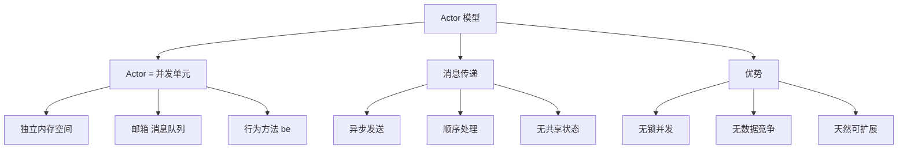
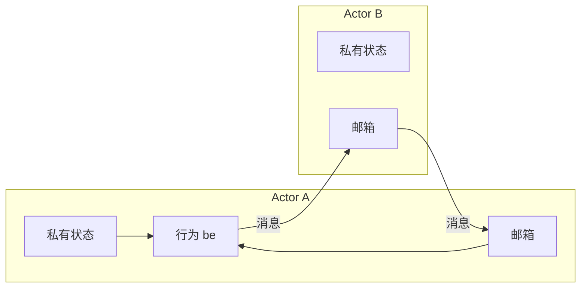

# 第 6 章 Actor 模型导论

> **本章目标**
> 理解 Actor 模型的核心思想——消息传递、内存隔离、异步执行，
> 掌握 Pony++ 中 actor 的定义、创建和基本使用。
>
> **学习时长**：40 分钟
> **前置要求**：第 4-5 章
> **对应 examples**：[`examples/02-actor/`](../examples/02-actor/)

---

## 6.1 概念地图



Actor 模型由 Carl Hewitt 于 1973 年提出，是处理并发最优雅的抽象之一。
Erlang、Akka、Orleans 都基于 Actor 模型。Pony++ 将它作为语言核心。

---

## 6.2 什么是 Actor

**Actor 是一个并发单元**，拥有：

1. **私有状态**：actor 内部的字段，外部不能直接访问
2. **邮箱（Mailbox）**：一个消息队列，接收其他 actor 发来的消息
3. **行为（Behavior）**：`be` 方法，逐条处理邮箱中的消息



### 6.2.1 Actor vs 线程 vs 进程

| 特性 | Actor | 线程 | 进程 |
|------|-------|------|------|
| 内存 | 私有 | 共享 | 私有 |
| 同步 | 无需锁 | 需要锁 | 无需锁 |
| 数量 | 百万个 | 数百个 | 数十个 |
| 创建开销 | 极小 | 中等 | 大 |
| 通信 | 消息传递 | 共享内存 | IPC |

**Actor 的核心优势**：你不需要锁。每个 actor 一次只处理一条消息，
天然避免了竞争条件。

---

## 6.3 完整示例：计数器 Actor

```pony
// counter-actor.pny - 计数器 Actor

actor Counter {
  var count: U32

  new create() => {
    count = 0
  }

  fun get_count(): U32 => {
    return count
  }

  be increment() => {
    count += 1
  }

  be reset() => {
    count = 0
  }
}

actor main {
  new create() => {
    var c: Counter = Counter()
    print(c.get_count())   // 0
    c.increment()
    c.increment()
    print(c.get_count())   // 2
    c.reset()
    print(c.get_count())   // 0
  }
}
```

预期输出：

```
0
2
0
```

编译运行：

```bash
ponyppc -o counter-actor.ponypp counter-actor.pny
wasmtime run counter-actor.ponypp
```

---

## 6.4 定义 Actor

### 6.4.1 基本语法

```pony
actor Actor名 {
  var 字段: 类型     // 私有状态

  new create(参数) => {
    // 构造函数
  }

  fun 方法(): 类型 => {
    // 纯方法（同步）
  }

  be 方法() => {
    // 行为方法（异步）
  }
}
```

### 6.4.2 actor vs class

| 特性 | `actor` | `class` |
|------|---------|---------|
| 并发 | 是（独立调度） | 否（同步执行） |
| 状态 | 私有，通过 `be` 修改 | 公开字段可直接访问 |
| 消息 | 通过 `be` 异步 | 通过 `fun` 同步 |
| 用途 | 并发单元、服务 | 数据结构、值类型 |

**选择原则**：

- 需要并发 → `actor`
- 纯数据 → `class`
- 需要异步通信 → `actor`
- 需要同步计算 → `class`

---

## 6.5 消息传递

### 6.5.1 异步发送

调用 actor 的 `be` 方法就是发送消息：

```pony
// message-send.pny - 消息发送

actor Worker {
  var name: String

  new create(name: String) => {
    this.name = name
  }

  be handle(msg: String) => {
    print(this.name + " received: " + msg)
  }
}

actor main {
  new create() => {
    var w1: Worker = Worker("Worker-1")
    var w2: Worker = Worker("Worker-2")

    w1.handle("Hello")    // 发送消息给 w1
    w1.handle("World")    // 发送消息给 w1
    w2.handle("Task A")   // 发送消息给 w2
  }
}
```

预期输出：

```
Worker-1 received: Hello
Worker-1 received: World
Worker-2 received: Task A
```

### 6.5.2 邮箱与顺序

每个 actor 有一个**邮箱**，消息按发送顺序排队：

```
main actor          Worker actor
    |                    |
    |-- handle("A") -->  |  邮箱: ["A"]
    |-- handle("B") -->  |  邮箱: ["A", "B"]
    |-- handle("C") -->  |  邮箱: ["A", "B", "C"]
    |                    |
    |              [依次处理]
    |              处理 "A" → print
    |              处理 "B" → print
    |              处理 "C" → print
```

**关键保证**：同一个 actor 的消息**严格按发送顺序**处理。
这消除了竞争条件——不需要锁。

---

## 6.6 Actor 隔离

### 6.6.1 状态隔离

每个 actor 的状态是**私有的**，外部不能直接访问：

```pony
// isolation.pny - 状态隔离

actor SafeCounter {
  var count: U32

  new create() => {
    count = 0
  }

  be increment() => {
    count += 1
    print(count)
  }

  be add(n: U32) => {
    count += n
    print(count)
  }
}

actor main {
  new create() => {
    var c1: SafeCounter = SafeCounter()
    var c2: SafeCounter = SafeCounter()

    c1.increment()      // c1: 1
    c1.increment()      // c1: 2
    c2.add(100)         // c2: 100
    c1.add(50)          // c1: 52

    // c1.count 直接访问是不允许的（编译器保护）
  }
}
```

预期输出：

```
1
2
100
52
```

### 6.6.2 为什么隔离很重要

传统多线程编程的噩梦：

```c
// C 多线程：需要锁
pthread_mutex_t lock;
int counter = 0;

void* worker(void* arg) {
    pthread_mutex_lock(&lock);    // 忘记加锁 → 数据竞争
    counter++;                    // 多个线程同时修改 → 崩溃
    pthread_mutex_unlock(&lock);
}
```

Pony++ 的 Actor 模型：

```pony
// Pony++ Actor：无需锁
actor Counter {
  var count: U32

  new create() => { count = 0 }

  be increment() => {
    count += 1    // 安全！一次只有一个消息在处理
  }
}
```

---

## 6.7 多 Actor 协作

### 6.7.1 生产者-消费者

```pony
// producer-consumer.pny - 生产者消费者

actor Producer {
  var name: String

  new create(name: String) => {
    this.name = name
  }

  be produce(item: String) => {
    print(this.name + " produced: " + item)
  }
}

actor Consumer {
  var name: String

  new create(name: String) => {
    this.name = name
  }

  be consume(item: String) => {
    print(this.name + " consumed: " + item)
  }
}

actor main {
  new create() => {
    var p: Producer = Producer("Producer-1")
    var c: Consumer = Consumer("Consumer-1")

    p.produce("apple")
    c.consume("apple")
    p.produce("banana")
    c.consume("banana")
  }
}
```

### 6.7.2 Actor 服务模式

将功能封装为 actor 服务：

```pony
// service.pny - Actor 服务

actor LogService {
  var entries: U32

  new create() => {
    entries = 0
  }

  be log(msg: String) => {
    entries += 1
    print("[" + entries.string() + "] " + msg)
  }

  be stats() => {
    print("Total entries: " + entries.string())
  }
}

actor main {
  new create() => {
    var logger: LogService = LogService()
    logger.log("System started")
    logger.log("User logged in")
    logger.log("Data saved")
    logger.stats()
  }
}
```

预期输出：

```
[1] System started
[2] User logged in
[3] Data saved
Total entries: 3
```

---

## 6.8 本章陷阱与误区

### 陷阱 1：be 调用不等待执行

```pony
actor Worker {
  var result: U32
  new create() => { result = 0 }

  be compute(x: U32) => {
    result = x * 2
  }

  be show() => {
    print(result)
  }
}

actor main {
  new create() => {
    var w: Worker = Worker()
    w.compute(21)
    w.show()    // 一定在 compute 之后执行（消息顺序保证）
  }
}
```

消息按顺序处理，所以 `show` 一定在 `compute` 之后。
但如果你期望"调用后立即返回结果"，那就错了——`be` 是异步的。

### 陷阱 2：在 fun 中调用其他 actor 的 be

```pony
actor A {
  new create() => {}
  be do_something() => { print("done") }
}

actor B {
  var a: A
  new create(a: A) => { this.a = a }

  fun trigger() => {
    // a.do_something()  // ✗ fun 中不能发送异步消息
  }

  be safe_trigger() => {
    a.do_something()    // ✓ be 中可以发送消息
  }
}
```

### 陷阱 3：actor 不能继承 class

```pony
class Base {
  new create() => {}
}

actor MyActor extends Base {  // ✗ actor 不能继承 class
  new create() => {}
}
```

---

## 6.9 本章实战：聊天室

用多个 actor 实现一个简单的聊天室：

```pony
// chatroom.pny - 聊天室

actor ChatRoom {
  var name: String
  var messages: U32

  new create(name: String) => {
    this.name = name
    this.messages = 0
  }

  be join(user: String) => {
    print(user + " joined " + this.name)
  }

  be send_msg(from: String, msg: String) => {
    this.messages += 1
    print("[" + this.name + "] " + from + ": " + msg)
  }

  be leave(user: String) => {
    print(user + " left " + this.name)
  }

  be stats() => {
    print("Room " + this.name + " has " + this.messages.string() + " messages")
  }
}

actor User {
  var name: String

  new create(name: String) => {
    this.name = name
  }

  be say(room: ChatRoom, msg: String) => {
    room.send_msg(this.name, msg)
  }
}

actor main {
  new create() => {
    var room: ChatRoom = ChatRoom("general")
    var alice: User = User("Alice")
    var bob: User = User("Bob")

    room.join("Alice")
    room.join("Bob")
    alice.say(room, "Hello everyone!")
    bob.say(room, "Hi Alice!")
    alice.say(room, "How are you?")
    room.leave("Bob")
    room.stats()
  }
}
```

预期输出：

```
Alice joined general
Bob joined general
[general] Alice: Hello everyone!
[general] Bob: Hi Alice!
[general] Alice: How are you?
Bob left general
Room general has 3 messages
```

---

## 6.10 习题

**习题 6.1** 解释 actor 和线程的三个核心区别。

**习题 6.2** 为什么 Pony++ 的 actor 不需要锁？

**习题 6.3** 写一个 `BankAccount` actor，有 `deposit`、`withdraw`、`balance` 方法。

**习题 6.4** 写一个 `TaskQueue` actor，可以接收任务并逐个处理。

**习题 6.5** 以下代码有什么问题？

```pony
actor Bad {
  var x: U32
  new create() => { x = 0 }

  fun set(v: U32) => {
    x = v    // 修改 actor 状态
  }
}
```

---

## 6.11 下一步

你已经理解了 Actor 模型的核心概念。下一章我们深入**消息传递与并发**——
如何在多个 actor 之间传递数据，如何处理并发场景。

→ **第 7 章：消息传递与并发**
