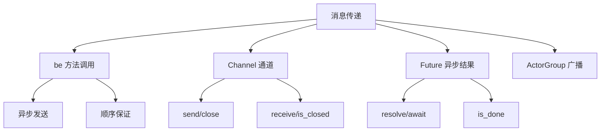

# 第 7 章 消息传递与并发

> **本章目标**
> 深入理解 Actor 间的消息传递机制，掌握 Channel、Future 等并发原语，
> 能够设计多 Actor 协作系统。
>
> **学习时长**：50 分钟
> **前置要求**：第 6 章
> **对应 examples**：[`examples/02-actor/02-message-passing.pny`](../examples/02-actor/02-message-passing.pny)、[`examples/03-concurrency/`](../examples/03-concurrency/)

---

## 7.1 概念地图



---

## 7.2 完整示例：消息流水线

```pony
// pipeline.pny - 消息流水线

actor Stage1 {
  be process(item: String) => {
    print("Stage1: " + item)
  }
}

actor Stage2 {
  be process(item: String) => {
    print("Stage2: " + item)
  }
}

actor Pipeline {
  var s1: Stage1
  var s2: Stage2

  new create() => {
    s1 = Stage1()
    s2 = Stage2()
  }

  be submit(item: String) => {
    s1.process(item)
    s2.process(item)
  }
}

actor main {
  new create() => {
    var p: Pipeline = Pipeline()
    p.submit("task-1")
    p.submit("task-2")
    p.submit("task-3")
  }
}
```

预期输出：

```
Stage1: task-1
Stage2: task-1
Stage1: task-2
Stage2: task-2
Stage1: task-3
Stage2: task-3
```

---

## 7.3 消息传递基础

### 7.3.1 be 调用即消息发送

```pony
// msg-basics.pny - 消息发送

actor Worker {
  var name: String
  var count: U32

  new create(name: String) => {
    this.name = name
    this.count = 0
  }

  be handle(msg: String) => {
    count += 1
    print(this.name + " [" + count.string() + "]: " + msg)
  }
}

actor main {
  new create() => {
    var w: Worker = Worker("W1")
    w.handle("first")
    w.handle("second")
    w.handle("third")
  }
}
```

预期输出：

```
W1 [1]: first
W1 [2]: second
W1 [3]: third
```

### 7.3.2 顺序保证

同一个 actor 的消息**严格按发送顺序**处理。这是 Pony++ 的核心保证：

```
发送顺序:  A → B → C
处理顺序:  A → B → C（永远如此）
```

这意味着你不需要担心"消息乱序"——编译器和运行时保证顺序。

### 7.3.3 跨 Actor 的消息

不同 actor 之间没有顺序保证：

```pony
// cross-actor.pny - 跨 actor 无顺序保证

actor A {
  be ping() => { print("A ping") }
}

actor B {
  be pong() => { print("B pong") }
}

actor main {
  new create() => {
    var a: A = A()
    var b: B = B()
    a.ping()
    b.pong()
    // 输出可能是 "A ping" 先或 "B pong" 先
    // 但在当前单线程实现中，按发送顺序执行
  }
}
```

---

## 7.4 Channel：消息通道

`Channel` 是 actor 之间的通信管道，类似 Go 的 channel。

### 7.4.1 基本用法

```pony
// channel-basic.pny - Channel 基本用法

import std.concurrent

actor Sender {
  var ch: Channel

  new create(ch: Channel) => {
    this.ch = ch
  }

  be send_all() => {
    this.ch.send("msg-0")
    this.ch.send("msg-1")
    this.ch.send("msg-2")
    this.ch.close()
  }
}

actor Receiver {
  var ch: Channel

  new create(ch: Channel) => {
    this.ch = ch
  }

  be receive_all() => {
    while not this.ch.is_closed() {
      var msg: String = this.ch.receive()
      print("Received: " + msg)
    }
  }
}

actor main {
  new create() => {
    var ch: Channel = Channel(10)
    var sender: Sender = Sender(ch)
    var receiver: Receiver = Receiver(ch)
    sender.send_all()
    receiver.receive_all()
  }
}
```

预期输出：

```
Received: msg-0
Received: msg-1
Received: msg-2
```

### 7.4.2 Channel API

| 方法 | 说明 |
|------|------|
| `Channel(capacity)` | 创建指定容量的通道 |
| `send(msg)` | 发送消息 |
| `receive()` | 接收消息 |
| `close()` | 关闭通道 |
| `is_closed()` | 检查是否已关闭 |

> **注意**：使用 Channel 需要 `import std.concurrent`。

---

## 7.5 Future：异步结果

`Future` 是异步计算的结果占位符。

### 7.5.1 基本用法

```pony
// future-basic.pny - Future 基本用法

import std

actor Task {
  var future: Future

  new create(future: Future) => {
    this.future = future
  }

  be execute() => {
    this.future.resolve("done")
  }
}

actor main {
  new create() => {
    var f: Future = Future()
    var task: Task = Task(f)
    task.execute()
    print(f.is_done())
    print(f.await())
  }
}
```

预期输出：

```
true
done
```

### 7.5.2 Future API

| 方法 | 说明 |
|------|------|
| `Future()` | 创建 Future |
| `resolve(value)` | 设置结果 |
| `await()` | 等待并获取结果 |
| `is_done()` | 检查是否已完成 |

---

## 7.6 ActorGroup：广播

`ActorGroup` 管理一组 actor，支持广播消息。

```pony
// actor-group.pny - ActorGroup 广播

actor Worker {
  var name: String

  new create(name: String) => {
    this.name = name
  }

  be handle(msg: String) => {
    print(this.name + " got: " + msg)
  }
}

actor main {
  new create() => {
    var group: ActorGroup = ActorGroup()
    var w1: Worker = Worker("W1")
    var w2: Worker = Worker("W2")
    var w3: Worker = Worker("W3")

    group.add(w1)
    group.add(w2)
    group.add(w3)

    print(group.count())      // 3
    group.broadcast("Hello")  // 所有成员收到消息
  }
}
```

预期输出：

```
3
W1 got: Hello
W2 got: Hello
W3 got: Hello
```

---

## 7.7 本章陷阱与误区

### 陷阱 1：Channel 未导入

```pony
// 忘记 import std.concurrent
var ch: Channel = Channel(10)  // ✗ 编译错误
```

### 陷阱 2：Channel 关闭后发送

```pony
ch.close()
ch.send("msg")  // ✗ 运行时错误：通道已关闭
```

### 陷阱 3：Future 未 resolve 就 await

```pony
var f: Future = Future()
print(f.await())  // 阻塞等待，永远不返回
```

---

## 7.8 本章实战：任务分发器

```pony
// dispatcher.pny - 任务分发器

import std.concurrent

actor TaskWorker {
  var name: String

  new create(name: String) => {
    this.name = name
  }

  be execute(task: String) => {
    print(this.name + " executing: " + task)
  }
}

actor Dispatcher {
  var workers: ActorGroup

  new create() => {
    workers = ActorGroup()
  }

  be register(w: TaskWorker) => {
    workers.add(w)
    print("Registered worker, total: " + workers.count().string())
  }

  be dispatch(task: String) => {
    workers.broadcast(task)
  }
}

actor main {
  new create() => {
    var dispatcher: Dispatcher = Dispatcher()
    var w1: TaskWorker = TaskWorker("Worker-1")
    var w2: TaskWorker = TaskWorker("Worker-2")

    dispatcher.register(w1)
    dispatcher.register(w2)
    dispatcher.dispatch("process-data")
  }
}
```

---

## 7.9 习题

**习题 7.1** 解释为什么同一个 actor 的消息有顺序保证，跨 actor 没有。

**习题 7.2** 用 Channel 实现一个生产者-消费者模式。

**习题 7.3** 用 Future 实现一个异步计算：actor 计算完成后通过 Future 返回结果。

**习题 7.4** 用 ActorGroup 实现一个广播通知系统。

---

## 7.10 下一步

下一章我们学习 Pony++ 的**能力系统**——编译期保证并发安全的核心机制。

→ **第 8 章：能力系统**
