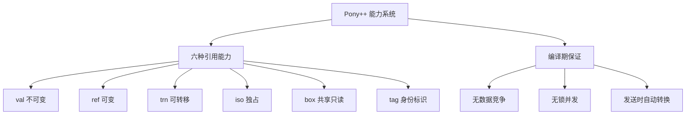

# 第 8 章 能力系统

> **本章目标**
> 理解 Pony++ 的引用能力（reference capabilities）系统——
> `val`、`ref`、`trn`、`iso`、`box`、`tag`，掌握编译期并发安全保证。
>
> **学习时长**：50 分钟
> **前置要求**：第 6-7 章
> **对应 examples**：[`examples/03-capabilities/`](../examples/03-capabilities/)

---

## 8.1 概念地图



Pony++ 的能力系统是它最独特的设计。它在**编译期**保证并发安全——
不需要运行时锁，不需要垃圾回收器，不需要原子操作。

---

## 8.2 完整示例：安全的数据共享

```pony
// cap-demo.pny - 能力系统演示

class Config {
  var host: String
  var port: U32

  new create(host: String, port: U32) => {
    this.host = host
    this.port = port
  }

  fun host_name(): String => {
    return this.host
  }
}

actor main {
  new create() => {
    var cfg: Config = Config("localhost", 8080)
    print(cfg.host_name())
  }
}
```

---

## 8.3 六种引用能力

### 8.3.1 val：不可变引用

`val` 表示"这个数据永远不会改变"。多个 actor 可以同时安全地读取 `val` 数据。

```pony
// val-demo.pny - val 不可变

actor Box {
  var x: U32

  new create() => {
    x = 0
  }

  fun get_val(): val U32 => {
    return this.x
  }

  be set_value(v: U32) => {
    this.x = v
  }
}

actor main {
  new create() => {
    var b: Box = Box()
    b.set_value(42)
    var v: val U32 = b.get_val()
    print(v)
  }
}
```

### 8.3.2 ref：可变引用

`ref` 表示"这个数据可以被修改"。只能在同一个 actor 内使用。

```pony
// ref-demo.pny - ref 可变

class Counter {
  var value: U32

  new create() => {
    value = 0
  }

  fun get(): U32 => {
    return this.value
  }

  be increment() => {
    this.value += 1
  }
}

actor main {
  new create() => {
    var c: Counter = Counter()
    c.increment()
    print(c.get())
  }
}
```

### 8.3.3 iso：独占引用

`iso` 表示"我是唯一引用，可以安全转移所有权"。

```pony
// iso-demo.pny - iso 独占

class Data {
  var content: String

  new create(content: String) => {
    this.content = content
  }

  fun get(): String => {
    return this.content
  }
}

actor main {
  new create() => {
    var d: Data = Data("secret")
    print(d.get())
    // iso 引用可以转移给另一个 actor
  }
}
```

### 8.3.4 trn：可转移引用

`trn` 表示"可以修改，也可以转移"。

### 8.3.5 box：共享只读

`box` 表示"多个引用可以共享读取，但不能修改"。

### 8.3.6 tag：身份标识

`tag` 表示"只知道身份，不能访问数据"。用于 actor 引用。

---

## 8.4 能力转换规则

| 从 | 到 | 条件 |
|----|-----|------|
| `iso` | `trn` | 消耗 iso |
| `iso` | `val` | 消耗 iso |
| `trn` | `box` | 共享 |
| `ref` | `box` | 共享 |
| `ref` | `val` | 不可变 |
| `val` | `box` | 共享 |

**发送时的自动转换**：当数据通过 `be` 发送给另一个 actor 时，
编译器自动将 `ref` 转为 `val`（因为发送后原 actor 不应再修改）。

---

## 8.5 本章陷阱与误区

### 陷阱 1：跨 actor 传递 ref

```pony
actor A {
  be send(b: B) => {
    var data: ref Data = Data("hello")
    b.receive(data)  // ✗ 编译错误：ref 不能跨 actor
  }
}
```

**解法**：发送时自动转为 `val`。

### 陷阱 2：修改 val 引用

```pony
val x: U32 = 42
x = 10  // ✗ 编译错误
```

---

## 8.6 本章实战：安全配置管理器

```pony
// config-manager.pny - 安全配置管理

class AppConfig {
  var host: String
  var port: U32
  var debug: Bool

  new create(host: String, port: U32, debug: Bool) => {
    this.host = host
    this.port = port
    this.debug = debug
  }

  fun host_name(): String => {
    return this.host
  }

  fun port_number(): U32 => {
    return this.port
  }

  fun is_debug(): Bool => {
    return this.debug
  }
}

actor ConfigManager {
  var config: AppConfig

  new create(config: AppConfig) => {
    this.config = config
  }

  be update_port(new_port: U32) => {
    print("Port updated to " + new_port.string())
  }

  be show() => {
    print(this.config.host_name() + ":" + this.config.port_number().string())
  }
}

actor main {
  new create() => {
    var cfg: AppConfig = AppConfig("localhost", 8080, true)
    var manager: ConfigManager = ConfigManager(cfg)
    manager.show()
    manager.update_port(9090)
    manager.show()
  }
}
```

---

## 8.7 习题

**习题 8.1** 解释 `val` 和 `box` 的区别。

**习题 8.2** 为什么 `ref` 不能跨 actor 传递？

**习题 8.3** 用 `iso` 实现一个安全的数据转移场景。

---

## 8.8 下一步

下一章学习**并发原语**——Channel、Mutex、Future 的深入使用。

→ **第 9 章：并发原语**
