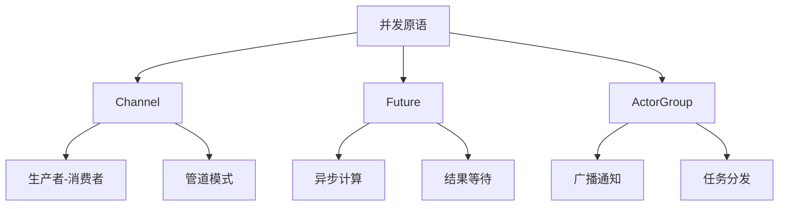

# 第 9 章 并发原语

> **本章目标**
> 掌握 Channel、Future、ActorGroup 三大并发原语的深入使用，
> 能够构建生产者-消费者、任务分发等并发模式。
>
> **学习时长**：45 分钟
> **前置要求**：第 7-8 章
> **对应 examples**：[`examples/03-concurrency/`](../examples/03-concurrency/)

---

## 9.1 概念地图



---

## 9.2 Channel 深入

### 9.2.1 生产者-消费者

```pony
// producer-consumer.pny - 生产者消费者

import std.concurrent

actor Producer {
  var ch: Channel

  new create(ch: Channel) => {
    this.ch = ch
  }

  be produce(items: U32) => {
    var i: U32 = 0
    while i < items {
      this.ch.send("item-" + i.string())
      i += 1
    }
    this.ch.close()
  }
}

actor Consumer {
  var ch: Channel
  var consumed: U32

  new create(ch: Channel) => {
    this.ch = ch
    this.consumed = 0
  }

  be consume_all() => {
    while not this.ch.is_closed() {
      var msg: String = this.ch.receive()
      this.consumed += 1
      print("Consumed: " + msg)
    }
    print("Total consumed: " + this.consumed.string())
  }
}

actor main {
  new create() => {
    var ch: Channel = Channel(100)
    var producer: Producer = Producer(ch)
    var consumer: Consumer = Consumer(ch)
    producer.produce(5)
    consumer.consume_all()
  }
}
```

### 9.2.2 管道模式

```pony
// pipeline.pny - 管道模式

import std.concurrent

actor Stage {
  var name: String
  var out_ch: Channel

  new create(name: String, out_ch: Channel) => {
    this.name = name
    this.out_ch = out_ch
  }

  be process(item: String) => {
    var processed: String = this.name + "(" + item + ")"
    print("Stage " + this.name + ": " + processed)
    this.out_ch.send(processed)
  }
}

actor main {
  new create() => {
    var ch1: Channel = Channel(10)
    var ch2: Channel = Channel(10)

    var stage1: Stage = Stage("S1", ch1)
    var stage2: Stage = Stage("S2", ch2)

    stage1.process("data")
    // 从 ch1 读取并传给 stage2
    var mid: String = ch1.receive()
    stage2.process(mid)
    ch2.receive()
    ch2.close()
  }
}
```

---

## 9.3 Future 深入

### 9.3.1 异步计算

```pony
// async-compute.pny - 异步计算

import std

actor Calculator {
  new create() => {}

  be square(x: U32, f: Future) => {
    f.resolve(x * x)
  }

  be cube(x: U32, f: Future) => {
    f.resolve(x * x * x)
  }
}

actor main {
  new create() => {
    var calc: Calculator = Calculator()

    var f1: Future = Future()
    calc.square(7, f1)
    print(f1.await())    // 49

    var f2: Future = Future()
    calc.cube(3, f2)
    print(f2.await())    // 27
  }
}
```

### 9.3.2 多任务聚合

```pony
// multi-future.pny - 多 Future 聚合

import std

actor Worker {
  var name: String

  new create(name: String) => {
    this.name = name
  }

  be work(f: Future) => {
    f.resolve(this.name + " done")
  }
}

actor main {
  new create() => {
    var w1: Worker = Worker("W1")
    var w2: Worker = Worker("W2")

    var f1: Future = Future()
    var f2: Future = Future()

    w1.work(f1)
    w2.work(f2)

    print(f1.await())
    print(f2.await())
  }
}
```

---

## 9.4 ActorGroup 深入

### 9.4.1 广播通知

```pony
// broadcast.pny - 广播通知

actor Subscriber {
  var name: String

  new create(name: String) => {
    this.name = name
  }

  be notify(msg: String) => {
    print(this.name + " received: " + msg)
  }
}

actor main {
  new create() => {
    var group: ActorGroup = ActorGroup()
    var s1: Subscriber = Subscriber("Sub-1")
    var s2: Subscriber = Subscriber("Sub-2")
    var s3: Subscriber = Subscriber("Sub-3")

    group.add(s1)
    group.add(s2)
    group.add(s3)

    print("Total subscribers: " + group.count().string())
    group.broadcast("System update available")
  }
}
```

---

## 9.5 本章陷阱与误区

### 陷阱 1：Channel 容量为 0

```pony
var ch: Channel = Channel(0)  // 容量为 0，send 可能阻塞
```

### 陷阱 2：忘记关闭 Channel

```pony
// 生产者忘记 close → 消费者永远等待
while not ch.is_closed() {
  ch.receive()  // 死循环
}
```

---

## 9.6 本章实战：异步任务调度器

```pony
// task-scheduler.pny - 异步任务调度器

import std

actor AsyncTask {
  var id: U32

  new create(id: U32) => {
    this.id = id
  }

  be run(f: Future) => {
    print("Task " + this.id.string() + " running")
    f.resolve("task-" + this.id.string() + "-result")
  }
}

actor Scheduler {
  var tasks: ActorGroup

  new create() => {
    tasks = ActorGroup()
  }

  be submit(task: AsyncTask) => {
    tasks.add(task)
    print("Submitted, total: " + tasks.count().string())
  }
}

actor main {
  new create() => {
    var scheduler: Scheduler = Scheduler()
    var t1: AsyncTask = AsyncTask(1)
    var t2: AsyncTask = AsyncTask(2)

    scheduler.submit(t1)
    scheduler.submit(t2)

    var f1: Future = Future()
    var f2: Future = Future()
    t1.run(f1)
    t2.run(f2)

    print(f1.await())
    print(f2.await())
  }
}
```

---

## 9.7 习题

**习题 9.1** 用 Channel 实现一个有界队列。

**习题 9.2** 用 Future 实现一个并行计算：多个 actor 同时计算，主 actor 等待所有结果。

**习题 9.3** 用 ActorGroup 实现一个观察者模式。

---

## 9.8 下一步

下一章学习**监督树与容错**——如何让 actor 系统在故障时自动恢复。

→ **第 10 章：监督树与容错**
