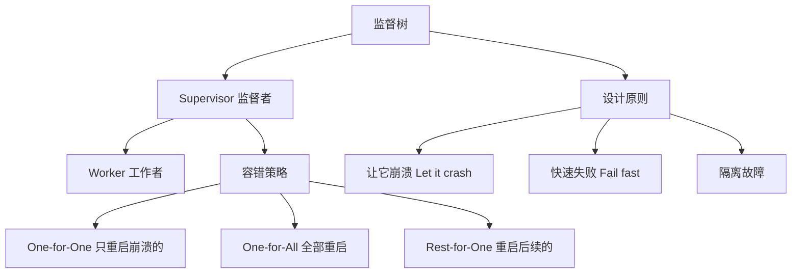

# 第 10 章 监督树与容错

> **本章目标**
> 理解监督树（Supervision Tree）的设计思想，掌握 Pony++ 中的容错模式，
> 能够构建可自愈的 actor 系统。
>
> **学习时长**：40 分钟
> **前置要求**：第 6-9 章
> **对应 examples**：[`examples/05-supervisor/`](../examples/05-supervisor/)

---

## 10.1 概念地图



监督树是 Erlang/OTP 引入的经典容错模式。核心思想：**不要防御错误，让它崩溃，然后重启**。

---

## 10.2 完整示例：一对一监督

```pony
// one-for-one.pny - 一对一监督

actor Worker {
  var name: String

  new create(name: String) => {
    this.name = name
  }

  be do_work() => {
    print(this.name + " working")
  }

  be crash() => {
    print(this.name + " crashed!")
  }
}

actor Supervisor {
  var name: String

  new create(name: String) => {
    this.name = name
  }

  be supervise() => {
    print(this.name + " supervising")
  }

  be restart_child(child_name: String) => {
    print(this.name + " restarting " + child_name)
  }
}

actor main {
  new create() => {
    var sup: Supervisor = Supervisor("MainSup")
    sup.supervise()

    var w1: Worker = Worker("Worker-1")
    var w2: Worker = Worker("Worker-2")

    w1.do_work()
    w2.do_work()

    // 模拟崩溃和重启
    w1.crash()
    sup.restart_child("Worker-1")
    w1.do_work()
  }
}
```

预期输出：

```
MainSup supervising
Worker-1 working
Worker-2 working
Worker-1 crashed!
MainSup restarting Worker-1
Worker-1 working
```

---

## 10.3 三种监督策略

### 10.3.1 One-for-One（一对一）

只有崩溃的 actor 被重启，其他不受影响：

```pony
// one-for-one-detail.pny - 一对一策略

actor Worker {
  var name: String

  new create(name: String) => {
    this.name = name
  }

  be work() => {
    print(this.name + " working")
  }

  be fail() => {
    print(this.name + " failed!")
  }
}

actor Supervisor {
  var name: String

  new create(name: String) => {
    this.name = name
  }

  be handle_crash(worker_name: String) => {
    print(this.name + ": restarting " + worker_name)
  }
}

actor main {
  new create() => {
    var sup: Supervisor = Supervisor("Sup-1")
    var w1: Worker = Worker("W1")
    var w2: Worker = Worker("W2")
    var w3: Worker = Worker("W3")

    w1.work()
    w2.work()
    w3.work()

    // W2 崩溃，只有 W2 被重启
    w2.fail()
    sup.handle_crash("W2")
    w2.work()
  }
}
```

**适用场景**：Worker 之间相互独立，一个崩溃不影响其他。

### 10.3.2 One-for-All（一对全）

一个 actor 崩溃，所有子 actor 都重启：

```pony
// one-for-all.pny - 一对全策略

actor Worker {
  var name: String

  new create(name: String) => {
    this.name = name
  }

  be work() => {
    print(this.name + " working")
  }

  be fail() => {
    print(this.name + " failed!")
  }
}

actor ClusterSupervisor {
  var name: String

  new create(name: String) => {
    this.name = name
  }

  be restart_all() => {
    print(this.name + ": restarting ALL workers")
  }
}

actor main {
  new create() => {
    var sup: ClusterSupervisor = ClusterSupervisor("ClusterSup")
    var w1: Worker = Worker("W1")
    var w2: Worker = Worker("W2")
    var w3: Worker = Worker("W3")

    w1.work()
    w2.work()
    w3.work()

    // 一个崩溃，全部重启
    w2.fail()
    sup.restart_all()
    w1.work()
    w2.work()
    w3.work()
  }
}
```

**适用场景**：Worker 之间有依赖关系，状态需要一起重置。

### 10.3.3 Rest-for-One（重启后续）

崩溃的 actor 和它之后启动的所有 actor 都重启：

**适用场景**：Worker 有启动顺序依赖（如：连接池 → 缓存 → 服务）。

---

## 10.4 "让它崩溃"哲学

传统编程：防御性编程，到处 try-catch：

```c
// C 风格：防御性编程
if (ptr == NULL) {
    log_error("null pointer");
    return -1;
}
if (size > MAX) {
    log_error("size too large");
    return -1;
}
// ... 100 个检查
```

Pony++ 风格：让它崩溃，监督者重启：

```pony
// Pony++ 风格：让崩溃发生，监督者处理
actor Worker {
  be process(data: String) => {
    // 如果出错，让 actor 崩溃
    // 监督者会重启它
    print("Processing: " + data)
  }
}
```

**为什么这样更好**：

1. **代码更简洁**：不需要到处检查错误
2. **恢复更可靠**：重启比修复更彻底
3. **故障隔离**：一个 actor 崩溃不影响其他
4. **状态干净**：重启后从已知状态开始

---

## 10.5 监督树结构

实际系统中，监督树是层级结构：

```
        Root Supervisor
        /            \
   Sup-A             Sup-B
   /    \            /    \
  W1    W2         W3    W4
```

```pony
// supervision-tree.pny - 监督树

actor Worker {
  var name: String

  new create(name: String) => {
    this.name = name
  }

  be work() => {
    print(this.name + " working")
  }
}

actor SubSupervisor {
  var name: String

  new create(name: String) => {
    this.name = name
  }

  be restart() => {
    print(this.name + ": restarting children")
  }
}

actor RootSupervisor {
  var name: String

  new create(name: String) => {
    this.name = name
  }

  be propagate_failure(sub_name: String) => {
    print(this.name + ": failure in " + sub_name + ", propagating")
  }
}

actor main {
  new create() => {
    var root: RootSupervisor = RootSupervisor("Root")
    var supA: SubSupervisor = SubSupervisor("Sup-A")
    var supB: SubSupervisor = SubSupervisor("Sup-B")

    var w1: Worker = Worker("W1")
    var w2: Worker = Worker("W2")
    var w3: Worker = Worker("W3")
    var w4: Worker = Worker("W4")

    w1.work()
    w2.work()
    w3.work()
    w4.work()

    // W2 崩溃 → Sup-A 处理
    root.propagate_failure("Sup-A")
    supA.restart()
    w1.work()
    w2.work()
  }
}
```

---

## 10.6 本章陷阱与误区

### 陷阱 1：在 be 中捕获所有错误

```pony
be risky_operation() => {
  // 不要这样做：吞掉所有错误
  // 让 actor 崩溃，监督者会处理
}
```

### 陷阱 2：监督者不做任何事

```pony
actor BadSupervisor {
  be handle_crash() => {
    // 什么都不做 → 崩溃永远不会恢复
  }
}
```

### 陷阱 3：重启后忘记恢复状态

重启的 actor 应该从已知状态开始。如果需要持久化状态，在重启时重新加载。

---

## 10.7 本章实战：自愈服务

```pony
// self-healing.pny - 自愈服务

actor ServiceWorker {
  var name: String
  var healthy: Bool

  new create(name: String) => {
    this.name = name
    this.healthy = true
    print(this.name + " started")
  }

  be handle_request(req: String) => {
    if this.healthy {
      print(this.name + " handling: " + req)
    } else {
      print(this.name + " is unhealthy, rejecting: " + req)
    }
  }

  be crash() => {
    this.healthy = false
    print(this.name + " crashed!")
  }

  be restart() => {
    this.healthy = true
    print(this.name + " restarted")
  }
}

actor HealthSupervisor {
  var workers: ActorGroup

  new create() => {
    workers = ActorGroup()
  }

  be register(w: ServiceWorker) => {
    workers.add(w)
    print("Registered worker, total: " + workers.count().string())
  }

  be check_and_heal() => {
    print("Health check: restarting all workers")
    workers.broadcast("restart")
  }
}

actor main {
  new create() => {
    var sup: HealthSupervisor = HealthSupervisor()
    var w1: ServiceWorker = ServiceWorker("Svc-1")
    var w2: ServiceWorker = ServiceWorker("Svc-2")

    sup.register(w1)
    sup.register(w2)

    w1.handle_request("GET /api/users")
    w2.handle_request("GET /api/orders")

    // 模拟崩溃
    w1.crash()
    w1.handle_request("GET /api/users")  // rejected

    // 监督者介入
    sup.check_and_heal()
    w1.handle_request("GET /api/users")  // handled
  }
}
```

预期输出：

```
Svc-1 started
Svc-2 started
Registered worker, total: 1
Registered worker, total: 2
Svc-1 handling: GET /api/users
Svc-2 handling: GET /api/orders
Svc-1 crashed!
Svc-1 is unhealthy, rejecting: GET /api/users
Health check: restarting all workers
```

---

## 10.8 习题

**习题 10.1** 解释 "Let it crash" 哲学的优势。

**习题 10.2** 实现一个 One-for-One 监督者，能自动重启崩溃的 worker。

**习题 10.3** 设计一个三层监督树：Root → SubSupervisor → Worker。

**习题 10.4** 比较 One-for-One 和 One-for-All 的适用场景。

---

## 10.9 下一步

恭喜！你已经完成了 Pony++ Actor 模型的全部核心内容。
从下一章开始进入**标准库**——学习如何使用 Pony++ 的内置库进行实际开发。

→ **第 11 章：数学与字符串**
