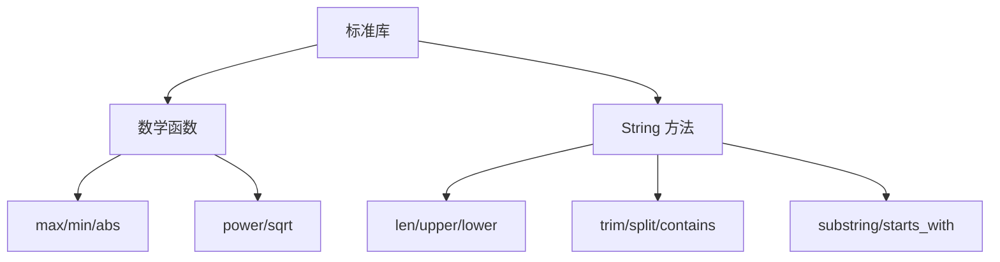

# 第 11 章 数学与字符串

> **本章目标**
> 掌握 Pony++ 标准库中的数学函数和字符串处理方法。
>
> **学习时长**：35 分钟
> **前置要求**：第 2-5 章
> **对应 examples**：[`examples/06-stdlib/01-string.pny`](../examples/06-stdlib/01-string.pny)

---

## 11.1 概念地图



---

## 11.2 数学函数

### 11.2.1 基本数学

```pony
// math-basic.pny - 基本数学函数

fun max(a: U32, b: U32): U32 => {
  if a > b {
    return a
  }
  return b
}

fun min(a: U32, b: U32): U32 => {
  if a < b {
    return a
  }
  return b
}

fun abs_val(a: I32): I32 => {
  if a < 0 {
    return 0 - a
  }
  return a
}

fun power(base: U32, exp: U32): U64 => {
  var result: U64 = 1
  var i: U32 = 0
  while i < exp {
    result = result * base.u64()
    i += 1
  }
  return result
}

actor main {
  new create() => {
    print(max(10, 20))      // 20
    print(min(10, 20))      // 10
    print(abs_val(-42))     // 42
    print(power(2, 10))     // 1024
  }
}
```

### 11.2.2 数学常量

| 常量 | 值 | 类型 |
|------|-----|------|
| π | 3.14159265358979 | F64 |
| e | 2.71828182845904 | F64 |

---

## 11.3 String 方法

### 11.3.1 基本操作

| 方法 | 返回类型 | 说明 |
|------|----------|------|
| `len()` | `U32` | 字符串长度 |
| `upper()` | `String` | 转大写 |
| `lower()` | `String` | 转小写 |
| `trim()` | `String` | 去除首尾空白 |
| `+` | `String` | 拼接 |
| `==` | `Bool` | 比较 |

```pony
// string-basic.pny - String 基本操作

actor main {
  new create() => {
    var s: String = "  Hello, World!  "

    print(s.len())          // 18
    print(s.upper())        // "  HELLO, WORLD!  "
    print(s.lower())        // "  hello, world!  "
    print(s.trim())         // "Hello, World!"
  }
}
```

### 11.3.2 查找与判断

| 方法 | 返回类型 | 说明 |
|------|----------|------|
| `contains(sub)` | `Bool` | 是否包含子串 |
| `starts_with(prefix)` | `Bool` | 是否以指定前缀开头 |
| `ends_with(suffix)` | `Bool` | 是否以指定后缀结尾 |

```pony
// string-search.pny - 查找与判断

actor main {
  new create() => {
    var s: String = "  Hello, World!  "

    print(s.contains("World"))     // true
    print(s.starts_with("  "))     // true
    print(s.ends_with("!  "))      // true
  }
}
```

### 11.3.3 截取与分割

| 方法 | 返回类型 | 说明 |
|------|----------|------|
| `substring(start, end)` | `String` | 截取子串 |
| `split(sep)` | `List[String]` | 按分隔符分割 |

```pony
// string-split.pny - 截取与分割

actor main {
  new create() => {
    var s: String = "  Hello, World!  "

    print(s.substring(2, 7))       // "Hello"

    var parts: List[String] = s.split(",")
    print(parts.len())             // 2
  }
}
```

---

## 11.4 本章实战：文本处理器

```pony
// text-processor.pny - 文本处理器

fun word_count(s: String): U32 => {
  var trimmed: String = s.trim()
  if trimmed.len() == 0 {
    return 0
  }
  var parts: List[String] = trimmed.split(" ")
  return parts.len()
}

fun shout(s: String): String => {
  return s.upper() + "!!!"
}

actor main {
  new create() => {
    var text: String = "  Hello Pony++ World  "

    print(text.trim())
    print(text.len())
    print(word_count(text))
    print(shout(text.trim()))
  }
}
```

---

## 11.5 习题

**习题 11.1** 写一个函数统计字符串中某个字符出现的次数。

**习题 11.2** 写一个函数判断字符串是否是回文。

**习题 11.3** 用 `split` 和 `len` 实现一个简单的 CSV 行解析器。

---

## 11.6 下一步

→ **第 12 章：数据结构——List 与 Map**
