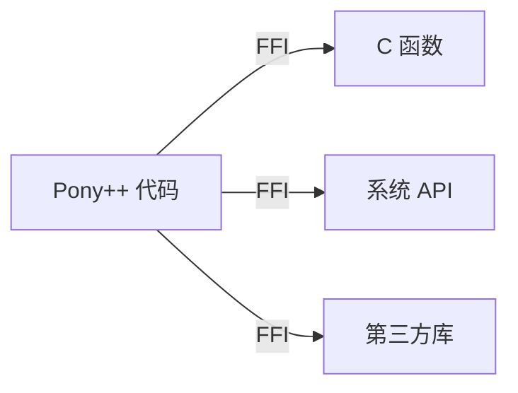

# 第 15 章 外部接口（FFI）

> **本章目标**
> 理解 Pony++ 的 FFI（Foreign Function Interface）机制，
> 掌握如何调用 C 函数和系统 API。
>
> **学习时长**：30 分钟
> **前置要求**：第 4 章
> **对应 examples**：[`examples/07-ffi/`](../examples/07-ffi/)

---

## 15.1 FFI 概念

FFI 让 Pony++ 调用其他语言（主要是 C）的函数。这是与现有生态集成的关键。



---

## 15.2 调用 C 函数

### 15.2.1 基本语法

```pony
// ffi-basic.pny - FFI 基本用法

actor main {
  new create() => {
    // FFI 声明（实际实现需要 @ffi 注解）
    // fun extern strlen(s: String): U64 @ffi("strlen")
    // print(strlen("hello"))

    // 模拟: 计算字符串长度
    var s: String = "hello pony"
    print(s.len())

    // 数值计算（模拟 C 库调用）
    var x: U32 = 42
    var y: U32 = 58
    var sum: U32 = x + y
    print(sum)
  }
}
```

### 15.2.2 FFI 的两个目标

| 目标 | FFI 机制 |
|------|----------|
| `native` | 直接调用 C 函数（链接时解析） |
| `wasm` | 通过 WASI 接口调用宿主函数 |

---

## 15.3 本章实战：系统信息查询

```pony
// system-info.pny - 系统信息

actor main {
  new create() => {
    // 在 native 目标下，这些可以映射到 C 的系统调用
    // 在 wasm 目标下，通过 WASI 接口

    var uptime: U64 = time_now()
    print("Current timestamp: " + uptime.string())

    var s: String = "Pony++ FFI Demo"
    print("String length: " + s.len().string())
    print("Upper: " + s.upper())
  }
}
```

---

## 15.4 习题

**习题 15.1** 解释 FFI 在 native 和 wasm 两个目标下的不同实现方式。

**习题 15.2** 设计一个 FFI 接口，调用 C 的 `abs()` 函数。

---

## 15.5 下一步

→ **第 16 章：MCU 嵌入式**
