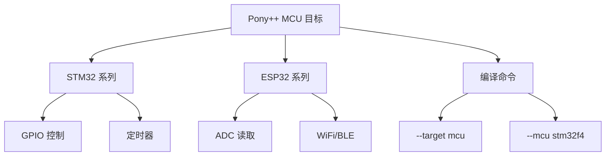

# 第 16 章 MCU 嵌入式（STM32/ESP32）

> **本章目标**
> 了解 Pony++ 在微控制器上的编译目标，掌握 GPIO、ADC 等硬件操作的 Actor 模式。
>
> **学习时长**：35 分钟
> **前置要求**：第 6 章（Actor 模型）
> **对应 examples**：[`examples/08-mcu/`](../examples/08-mcu/)

---

## 16.1 概念地图



Pony++ 的 Actor 模型天然适合嵌入式——每个外设一个 Actor，消息驱动，无需中断嵌套。

---

## 16.2 GPIO 控制：LED 闪烁

```pony
// blink-led.pny - STM32 LED 闪烁

actor Gpio {
  var pin: U32
  var state: Bool

  new create(pin: U32) => {
    this.pin = pin
    this.state = false
  }

  be set_high() => {
    this.state = true
    print("GPIO HIGH")
  }

  be set_low() => {
    this.state = false
    print("GPIO LOW")
  }

  fun is_high(): Bool => {
    return this.state
  }
}

actor Timer {
  var interval_ms: U32

  new create(interval_ms: U32) => {
    this.interval_ms = interval_ms
  }

  be start() => {
    print("Timer started")
  }

  be stop() => {
    print("Timer stopped")
  }
}

actor main {
  new create() => {
    var led: Gpio = Gpio(5)
    var timer: Timer = Timer(500)
    timer.start()

    led.set_high()
    led.set_low()
    led.set_high()

    timer.stop()
  }
}
```

编译命令：

```bash
ponyppc --target mcu --mcu stm32f4 -o blink blink-led.pny
```

---

## 16.3 ADC 读取：模拟传感器

```pony
// read-adc.pny - ESP32 ADC 读取

actor Adc {
  var channel: U32
  var value: U32

  new create(channel: U32) => {
    this.channel = channel
    this.value = 0
  }

  be read() => {
    this.value = 2048
    print("ADC read")
  }

  fun get_value(): U32 => {
    return this.value
  }
}

actor main {
  new create() => {
    var adc: Adc = Adc(3)
    adc.read()
    print(adc.get_value())
  }
}
```

编译命令：

```bash
ponyppc --target mcu --mcu esp32 -o read-adc read-adc.pny
```

---

## 16.4 嵌入式 Actor 设计模式

### 16.4.1 每个外设一个 Actor

```pony
// hw-actors.pny - 硬件 Actor 模式

actor Led {
  var pin: U32

  new create(pin: U32) => {
    this.pin = pin
  }

  be on() => { print("LED ON") }
  be off() => { print("LED OFF") }
  be blink(times: U32) => {
    var i: U32 = 0
    while i < times {
      print("LED BLINK")
      i += 1
    }
  }
}

actor Button {
  var pin: U32

  new create(pin: U32) => {
    this.pin = pin
  }

  be on_pressed() => { print("Button pressed") }
  be on_released() => { print("Button released") }
}

actor SensorReader {
  var adc_channel: U32

  new create(channel: U32) => {
    this.adc_channel = channel
  }

  be sample() => { print("Sensor sampled") }
}

actor main {
  new create() => {
    var led: Led = Led(5)
    var btn: Button = Button(13)
    var sensor: SensorReader = SensorReader(0)

    led.blink(3)
    btn.on_pressed()
    sensor.sample()
  }
}
```

---

## 16.5 本章陷阱与误区

### 陷阱 1：MCU 目标不支持浮点

某些 MCU（如 Cortex-M0）没有 FPU。避免使用 `F32`/`F64`，用整数运算替代。

### 陷阱 2：递归导致栈溢出

MCU 栈空间有限（通常 4-8KB）。递归深度不要超过 100 层。

### 陷阱 3：动态内存分配

尽量避免在 MCU 上使用 `List[T]` 等需要动态分配的类型。用固定大小的数组。

---

## 16.6 习题

**习题 16.1** 设计一个交通灯 Actor：红 → 绿 → 黄 → 红 循环。

**习题 16.2** 用 Actor 模式实现一个按键防抖动逻辑。

**习题 16.3** 比较 Pony++ Actor 模式和传统中断驱动模式的优缺点。

---

## 16.7 下一步

→ **第 17 章：浏览器 WASM 组件**
