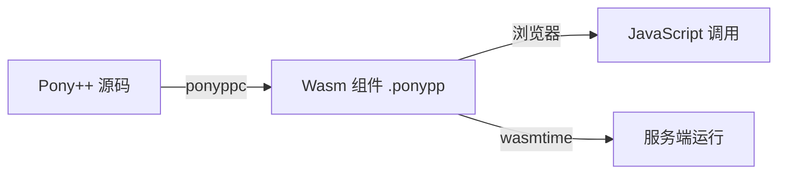

# 第 17 章 浏览器 WASM 组件

> **本章目标**
> 了解 Pony++ 编译到 WebAssembly 组件后在浏览器中运行的方式。
>
> **学习时长**：30 分钟
> **前置要求**：第 1 章
> **对应 examples**：[`examples/09-web/`](../examples/09-web/)

---

## 17.1 WASM 组件模型

Pony++ 编译到 Wasm 组件（`.ponypp`），可以在浏览器中通过 WebAssembly API 调用。



---

## 17.2 完整示例：浏览器问候组件

```pony
// greeter.pny - 浏览器问候组件

actor Greeter {
  var name: String

  new create(name: String) => {
    this.name = name
  }

  fun greet(): String => {
    return "Hello, " + this.name + "!"
  }

  be set_name(new_name: String) => {
    this.name = new_name
  }

  fun get_name(): String => {
    return this.name
  }
}

actor main {
  new create() => {
    var g: Greeter = Greeter("World")
    print(g.greet())

    g.set_name("Browser")
    print(g.greet())
  }
}
```

编译：

```bash
ponyppc -o greeter.ponypp greeter.pny
wasmtime run greeter.ponypp
```

---

## 17.3 交互式组件：计数器

```pony
// counter-web.pny - 浏览器计数器组件

actor Counter {
  var count: U32

  new create() => {
    this.count = 0
    print("Counter initialized")
  }

  be increment() => {
    this.count += 1
  }

  be decrement() => {
    if this.count > 0 {
      this.count -= 1
    }
  }

  fun get_count(): U32 => {
    return this.count
  }

  be reset() => {
    this.count = 0
  }
}

actor main {
  new create() => {
    var c: Counter = Counter()
    c.increment()
    c.increment()
    c.increment()
    c.decrement()
    print(c.get_count())   // 2
    c.reset()
    print(c.get_count())   // 0
  }
}
```

---

## 17.4 浏览器集成模式

在 JavaScript 中调用 Pony++ Wasm 组件：

```javascript
// main.js
async function main() {
  const wasm = await WebAssembly.instantiateStreaming(
    fetch('greeter.ponypp')
  );
  // 调用导出的函数
  const result = wasm.instance.exports.greet();
  console.log(result);
}
```

---

## 17.5 习题

**习题 17.1** 编译一个 Pony++ 组件并在 wasmtime 中运行。

**习题 17.2** 设计一个可以在浏览器中调用的温度转换 Wasm 组件。

---

## 17.6 下一步

→ **第 18 章：综合实践——计数器服务**
